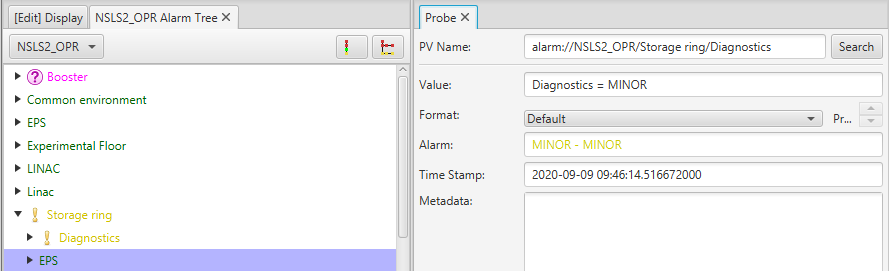
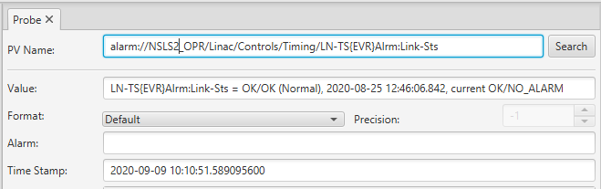

Alarm Datasource
================

Overview
--------
The Alarm System allow users to view and handle the alarms triggered by Process Variables (PVs)
on front-end computers (IOCs). There are a set of dedicated applications (Alarm tree, table, and panel) which display
alarms and alarm related information (like guidance). These applications also provide the ability
to take a set of actions needed to effectively handle an alarm.

The alarm datasource provides a subsection of the alarm information and functionality.
This makes it possible for user to access beast alarm information of any other cs-studio application.
OPI screens can now embed informatino about from the alarm server, like the acknowledgement state of a pv, etc..

PV syntax
---------

The standard prefix for the datasource is ``alarm://`` which can be omitted if configured as the default datasource.

``alarm`` pvs can be used to connect to any node or leaf from the alarm tree.
The alarm tree represents the configured hierarchy of the alarm pv's, the hierarchy consists of multiple
nodes and alarming pv's

| Node(Area): Front end, DTL, Linac, Storage Ring, ...
| Node(System): ICS, Cooling, Vacuum, RF, ...
| Node(Optionally sub-system): ICS/IOCs, RF/LLRF, RF/HPRF, ...
| Alarm Trigger PVs on the final level.

You can create a alarm channel for any Alarm Trigger PVs or for any Area, System, Subsystem.
 ::

  # alarm://complete_path_to_area
  alarm://NSLS2_OPR/Storage ring/Diagnostics

  # alarm://complete_path_to_system
  alarm://NSLS2_OPR/Linac/Controls/Timing/LN-TS{EVR}Alrm:Link-Sts

==================
Reading alarm pv's
==================

The ``alarm://`` pvs return a VString describing the alarm state of the associated node or leaf in the alarm tree

e.g.

| Connecting to a node
| ``alarm://NSLS2_OPR/Storage ring/Diagnostics``
| returns
| "Diagnostics = MINOR"

The return value is a VString, with the string value describing the alarm state of the node. The Alarm meta data of the pv also
matches the alarm state.

| Connecting to a leaf
| ``alarm://NSLS2_OPR/Linac/Controls/Timing/LN-TS{EVR}Alrm:Link-Sts``
| returns
| "LN-TS{EVR}Alrm:Link-Sts = OK/OK (Normal), 2020-08-25 12:46:06.842, current OK/NO_ALARM"

The return value is a VString, with the string value describing the alarm state along with a description of the
pv's alarm value if present and its current alarm value. The Alarm meta data of the pv also
matches the alarm state.

--------------
Special Fields
--------------

The alarm pvs have a few additional fields which can be used to access specific attributes of the alarm node/leaf

These fields can be used by appending the following field tag at the end the alarm pv.

e.g.

| ``alarm://NSLS2_OPR/Linac/Controls.state``

| **.state**
| Returns an Enum indicating the current alarm state of the alarm node/leaf.

| **.active**
| Return a Boolean true if the alarm pv is active. An active alarm pv is one which is currently in an alarm state which AND it has not been acknowledged.

| **.enabled**
| Returns a Boolean true if the alarm pv is enabled. This is a writeable field which can be used to enabled or disabled the associated alarm element in the tree.

| **.duration**
| Returns a String with the duration since this alarm pv has been in an alarm state.

=====================
Writing to alarm pv's
=====================

``alarm://NSLS2_OPR/SR/Vacuum``

------------
acknowledge
------------

The alarm pvs can be used to acknowledge or unacknowledge parts of the alarm tree.
The alarm pvs accept String, boolean, and Number values which are interpreted as follows:

When writing **strings**

| "ack" or "acknowledge"

Acknowledge all alarms associated with the node or leaf of the alarm tree associated with this alarm pv

| "unack" or "unacknowledge"

Unacknowledge all the alarms associated with the node or leaf of the alarm tree associated with this alarm pv

When writing **Numbers**

Writing any non zero number is treated as an acknowledge while 0 will unacknowledge an alarm

When writing **booleans**

A "true" value is to acknowledge an alarm while a "false" value will unacknowledge an alarm

-------
enable
-------

The alarm pvs can be used to enable or disable parts of the alarm tree.
The alarm pvs accept String values which are interpreted as follows:

When writing **strings**

| "enable"
| Enable all alarms associated with the node or leaf of the alarm tree associated with this alarm pv

| "disable"
| Disable all the alarms associated with the node or leaf of the alarm tree associated with this alarm pv
