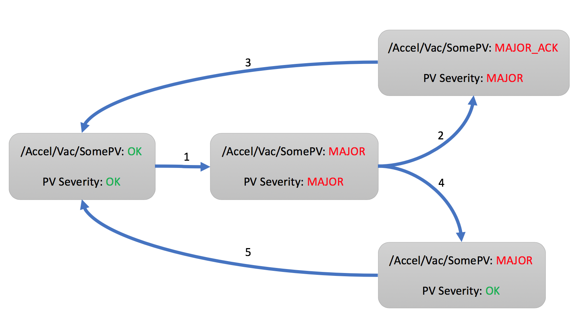
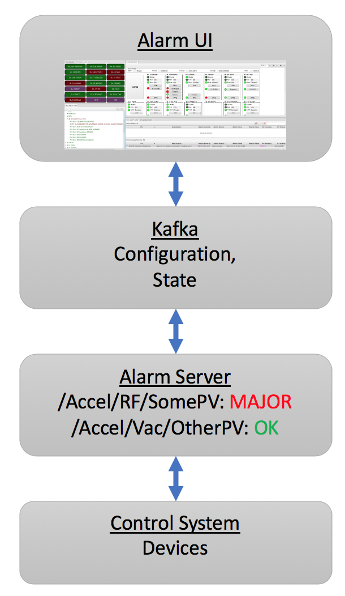

Alarms
======

Overview
--------

The alarm system monitors the alarm state for a configurable list of PVs.
When the alarm severity of any PV changes from `OK` to for example `MAJOR`,
the alarm system changes to that same alarm severity (transition 1 in the diagram below).

For the overall alarm to return to `OK`, two things need to happen:

 * The alarm severity of the PV must return to `OK`
 * The alarm must be acknowledged

Typically, the alarm will persist for a while.
A user acknowledges the alarm (2) and starts to address the underlying issue.
Eventually, the reason for the alarm is removed, the severity of the PV recovers to `OK`,
and the alarm system returns to an overall `OK` state (3).

It is also possible that the underlying issue is short lived, and the 
PV recovers to `OK` on its own.
The alarm system latches the alarm, so users can see that there was an
alarm (4). When the user acknowledges the alarm, the system returns
to an overall `OK` state (5).

The order of PV recovery and acknowledgement does therefore not matter.
There are two more details which are not shown in the diagram.

The alarm system maximizes the alarm severity of a PV.
Assume a PV enters the alarm state (1) because its severity is `MINOR`.
The alarm state will also be `MINOR`. If the PV severity now changes to `MAJOR`,
the alarm state will become `MAJOR` as well. Should the PV severity now return to `MINOR`,
the alarm state will remain `MAJOR` because the alarm system takes note of the highest
PV severity.
As already shown in (4), a PV severity clearing to `OK` still leaves the alarm state
at the highest observed severity until acknowledged.

Finally, while alarms will by default `latch` as described above, an alarm
can be configured to not latch. When such a non-latching PV enters an alarm state (1),
once the PV recovers, it will right away return to `OK` via (4) and (5) without
requiring acknowledgement by an end user.

Note that the alarm system reacts to PVs.
Details of how PVs generate alarms, for example at which threshold
an analog reading would enter a `MINOR` alarm state are determined
in the control system.
The alarm system can notify users of an alarm, but it cannot explain
why the alarm happened and what the user should do.
Each alarm should be configured with at least one "guidance" message
to explain the alarm and a "display" link to a related control system
screen.

Components
----------

The alarm system consists of an alarm server and a user interface.

The Alarm Server monitors a set of PVs, tracking their alarm state.
The alarm server tracks updates to the PVs received from the control system.

The user interface shows the current alarms, allows acknowledgement,
and provides guidance, links to related displays.

Kafka stores the alarm system configuration, and provides the
communication bus between the alarm server and user interface.

Refer to `applications/alarm/Readme.md` for setting up Kafka
and the alarm server.

User Interface
--------------

The UI includes the following applications:

 * Alarm Tree: Primarily used to configure the alarm system,
   i.e. to add PVs and define their alarm details.

   The alarm configuration is hierachical,
   starting from for example a top-level `Accelerator`
   configuration to components like `Vacuum`, `RF`,
   with alarm trigger PVs listed below those components.
   Configuration settings for `Guidance`, `Displays` etc.
   are inherited along the hierarchy, so that all alarm under
   `/Accelerator/Vacuum` will see all the guidance and displays
   configured on `Vacuum`.

   The alarm system does not enforce how the hierachical configuration
   is used. The 'components' could be subsystems like `Vacuum`, `RF`,
   or they could refer to areas of the machine like `Front End`,
   `Ring`, `Beam Line`. There can be several levels of sub-components,
   and each site can decide how to arrange their alarm trigger PVs
   to best re-use guidance and display information so that the configuration
   of individual PVs is simplified by benefitting from the inherited
   settings along the hierarchy.

 * Alarm Table: Main runtime interface, shows current alarms.

   Ideally, this table will be empty as the machine is running without issues.
   Once alarms occur, they are listed in a table that users can sort by PV name,
   description, alarm time etc.

   The context menu of selected alarms offers links to guidance messages and
   related displays.  

   Alarms can be acknowledged, which moves them to a separate table of acknowledged
   alarms.

 * Alarm Area Panel: Shows summary of top-level alarm hierarchy components.

   Useful as a basic alarm status indicator that can be checked "across the room".

 * Annunciator: Annunciates alarms.

   Optional component for voice annunciation of new alarms.

Each of the above alarm apps can be launched from the menu.
They can also be opened from the cmd line as follows::

    -resource alarm://localhost/Accelerator?app=alarm_tree
    -resource alarm://localhost/Accelerator?app=alarm_table
    -resource alarm://localhost/Accelerator?app=alarm_area

Alarm Configuration Options
---------------------------

The options for an entry in the hierarchical alarm configuration
always include guidance, display links etc. as described further below.
In addition, alarm PV entries have the following settings.

Description
^^^^^^^^^^^
This text is displayed in the alarm table when the alarm triggers.

The description is also used by the alarm annunciator.
By default, the annunciator will start the actual message with
the alarm severity. For example, a description of "Vacuum Problem"
will be annunciated as for example "Minor Alarm: Vacuum Problem".
The addition of the alarm severity can be disabled by starting
the description with a "\*" as in "\* Vacuum Problem".

When there is a flurry of alarms, the annunciator will summarize
them to "There are 10 more alarms". To assert that certain alarms
are always annunciated, even if they occur within a burst of other alarms,
start the message with "!" (or "\*!").

Behavior
^^^^^^^^

 * Enabled:
   De-select to disable an alarm, i.e. to ignore the value of this alarm trigger PV.

 * Latch:
   By default, alarms latch to the highest received severity until the alarm is acknowledged
   and clears. De-select if the alarm should recover without requiring acknowledgement.

 * Annunciate:
   Should the alarm be annunciated (if the annunciator is running), or should it only
   be displayed silently?

 * Alarm Delay:
   Only alarm if the trigger PV remains in alarm for at least this time,
   see examples below.
   
 * Alarm Count:
   Used in combination with the alarm delay.
   If the trigger PVs exhibits a not-OK alarm severity more more than 'count' times
   within the alarm delay, recognize the alarm.

   For example, an alarm delay of 10 with an alarm count of 5 means:
   Recognise an alarm if the PV enters a not-OK severity for more than 10 seconds,
   or more often than 5 times within 10 seconds.

   When the count is zero, only the alarm delay is used.

 * Enabling Filter:
   An optional expression that can enable the alarm based on other PVs.
   
   Example: `'abc' > 10` will only enable this alarm if the PV 'abc' has a value above 10.

The Alarm Delay and Count work in combination.
By default, with both the alarm delay and count at zero, a non-OK PV severity is right away recognized.
When the alarm delay is larger than zero, it starts a timer to check the PV after the given delay.
For example, assume an alarm delay of 10 seconds, and the PV enters a MINOR alarm.
If the PV still carries a not-OK severity after 10 seconds,
the alarm state becomes MINOR or whatever the highest alarm severity of the PV was
in the 10 seconds since first entering a not-OK severty.
On the other hand, if the PV recovers to OK, there will be no alarm after the 10 second delay.

As a second example, consider a PV that assumes MINOR severity, then recovers to OK and re-enters MINOR severity a couple of times.
If the non-OK severity never persists longer then 10 seconds, it is ignored.
The alarm count can be used to detect such cases. With an alarm count of 5, even if each non-OK severity lasts only say 1 second,
when the PV becomes not-OK for 5 or more times within 10 seconds, the alarm will be indicated.
For a delay of 10 seconds and a count of 5, there are thus two ways to enter an alarm state:
Either the PV stays not-OK for at least 10 seconds,
or it briefly becomes not-OK for at least 5 times within 10 seconds.

While the filter, alarm delay and count can be helpful to reduce the number of alarms from 'noisy' PVs,
ideally all such logic is implemented at the source, i.e. in the IOC that provides the alarm trigger PV.
This not only simplifies the task of the alarm system, but also makes the behavior more obvious,
since a PV is used "as is", the alarm server uses the same alarm state that is indicated in a display panel,
without adding filtering that might not be obvious when later inspecting an alarm.

Note again that the alarm system only reacts to the severity of alarm trigger PVs.
For EPICS records, this is for example configured via the HIGH, HSV and HYST fields of analog records,
or the ZSV and OSV fields of binary records.
Why, when and for how long an alarm trigger PV enters an alarm state is configured on the data source,
and is not immediately obvious from the received alarm severity.

For example, an analog record might enter a MINOR alarm state when its value exceeds the 'HIGH' value.
Why a certain HIGH threshold was chosen, what the user should do about it, and how the threshold could
be changed, however, cannot be automatically determined.
When adding an alarm trigger PV to the alarm system, it is thererfore important to also configure
guidance and display links which allow the user to figure out:

 * What does this alarm mean? What should I do about it?
 * What displays allow me to see more, where can I do something about the alarm?

Guidance
--------

Each alarm should have at least one guidance message to explain the meaning
of an alarm to the user, to list for example contact information for subsystem experts.
Guidance can be configured on each alarm PV, but it can also be configured on
parent components of the alarm hierarchy.

 * Title:
   A short title for the guidance that will appear in the context menu of the alarm,
   for example "Contacts" or "What to do".

 * Detail:
   A slightly longer text with the content of the guidance, for example a list of
   telephone numbers, or description of things to try for handling the alarm.

Displays
--------

As with Guidance, each alarm should have at least one link to a control
system display that shows the actual alarm PV and the surrounding subsystem.

 * Title:
   Short title for the display link that will appear in the context menu,
   for example "Vacuum Display".

 * Detail:
   The display link.
   This is handled similar to `-resource..` arguments passed on the command line.
   For plain display files, the complete path to the file will suffice,
   and the display tool is recognized by the file extension,
   i.e. `*.bob` for the display runtime, or `*.html` to open a web page.
   When passing macros, a complete URL is required.
   

Examples::

    /path/to/display.bob
    http://server.site/path/to/display.bob
    http://server.site/path/to/display.bob?MACRO=Value&ANSWER=42
    file:///path/to/display.bob?MACRO=Value&OTHER=42$NAME=Text+with+spaces

Automated Actions
-----------------

Automated actions are performed when the node in the alarm hierarchy enters and remains in
an active alarm state for some time.

The intended use case for automated action is to for example send emails
in case operators are currently unable to acknowledge and handle the alarm.
If the alarm should always right away perform some action,
then this is best handled in the IOC.

The automated action configuration has three parts:

 * Title:
   The "Title" can be set to a short description of the action.

 * Delay:
   The "Delay", in seconds, determines how long the node needs to be in an active alarm state
   before the automated action is executed.
   A delay of 0 seconds will immediately execute the action, which in practice
   suggests that the action should be implemented on an IOC.

 * Detail:
   The "Detail" determines what the automated action will do.

``mailto:user@site.org,another@else.com``:
Sends email with alarm detail to list of recipients.

The email server is configured in the alarm preferences.

``cmd:some_command arg1 arg2``:
Invokes command with list of space-separated arguments.
The special argument "*" will be replaced with a list of alarm PVs and their alarm severity.
The command is executed in the ``command_directory`` provided in the alarm preferences.
 
 
``sevrpv:SomePV``:
Names a PV that will be updated with the severity of the alarm,
i.e. a value from 0 to 9 to represent the acknowledged or active
alarm state.
The delay is ignored for ``sevrpv:`` actions.

Suggested PV template::
 
    # Example for "Severity PV"
    # used with automated action set to "sevrpv:NameOfPV"
    #
    # softIoc -s -m N=NameOfPV -d sevrpv.db
    
    record(mbbi, "$(N)")
    {
        field(ZRVL, 0)
        field(ZRST, "OK")
        field(ONVL, 1)
        field(ONST, "MINOR_ACK")
        field(ONSV, "MINOR")
        field(TWVL, 2)
        field(TWST, "MAJOR_ACK")
        field(TWSV, "MAJOR")
        field(THVL, 3)
        field(THST, "INVALID_ACK")
        field(THSV, "INVALID")
        field(FRVL, 4)
        field(FRST, "UNDEFINED_ACK")
        field(FRSV, "INVALID")
        field(FVVL, 5)
        field(FVST, "MINOR")
        field(FVSV, "MINOR")
        field(SXVL, 6)
        field(SXST, "MAJOR")
        field(SXSV, "MAJOR")
        field(SVVL, 7)
        field(SVST, "INVALID")
        field(SVSV, "INVALID")
        field(EIVL, 8)
        field(EIST, "UNDEFINED")
        field(EISV, "INVALID")
        field(INP,  "0")
        field(PINI, "YES")
    }
 
 
