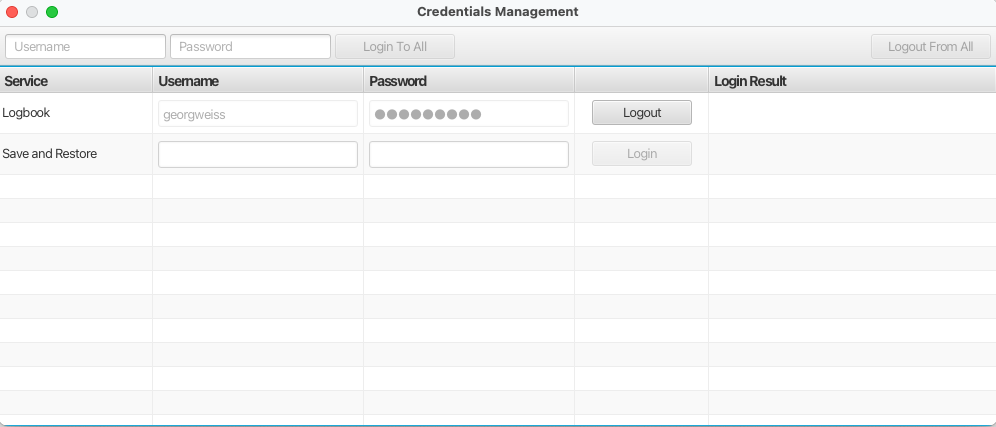

Credentials Management
======================

Some applications may need to prompt the user for credentials, e.g. when interacting with a protected
remote service. One such example would be the electronic logbook.

Further, Phoebus may be configured to store the credentials entered by the user to avoid repeated prompts.
In order to also support an explicit logout capability, the Credentials Management application offers means to
remove stored credentials.

The application is launched using the dedicated button in the (bottom) status bar.

The below screen shot shows an example where credentials have been stored for the "Logbook" scope,
plus an option to login to the "<remote service>" scope. User may also choose to "Logout from all" services,
i.e. to remove all stored credentials.

If no credentials are stored in the credentials store, and if no services supporting authentication are available,
the Credentials Management UI will show a static message:

The "Login To All" button can be used to login to all services as a single action.
In this case credentials entered in the text fields of toolbar at the top are used for all services, irrespective of
the credentials (if any) entered in other input fields.

If login to a service fails (service off-line or invalid credentials), this is indicated in the "Login Result" column.

If on the other hand login succeeds to a single or all services, the dialog is closed automatically.