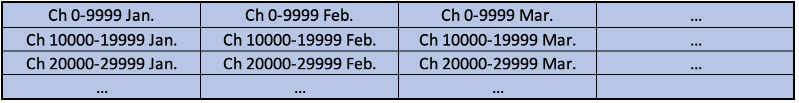
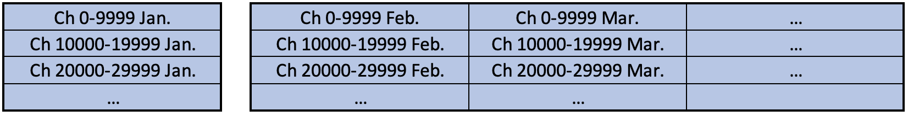

TimescaleDB Archive
===================

Allows RDB archive engine and Data Browser data retrieval to use TimescaleDB.

For storing historic control system data, there are fundamentally two approaches.
Use a generic relational database, or an optimized storage format.

A relational database like Oracle, MySQL or PostgreSQL offers
a long track record of reliably storing data,
providing network access from every programming language,
supporting numerous ways to query the data
and to maintain it for years.

An optimized storage format tends to be faster for simple data insertion
and retrieval, but eventually many of the features provided
by an RDB are desired and then need to be implemented.

TimescaleDB is an extension to PostgreSQL that promises to combine advantages from both approaches.
The data is stored in an RDB, but the storage is optimized for time series data,
supporting partitioning and adding time-aware retrieval methods which improve performance over
a plain RDB approach.

Instead of storing all samples into one RDB table like this:

TimescaleDB allows storing the data in "chunks", for example creating
one chunk per month: 

Chunks may additionally split the data by channel IDs:

There are several advantages to "chunking":

 * Data retrieval is optimized by quickly identifying the chunks to read instead
   of scanning one large table.
 * Data insertion, limited to the "latest" chunks, can be faster than appending
   to one large table.
 * When running out of disk space, older chunks can be compressed or removed very efficiently.

Finally, selected chunks can be placed in separate table spaces, i.e., spread across different disks:

While it is possible to similarly optimize any Oracle or PostgreSQL setup by using
site-specific scripts and stored procedures to create "partitions" based on time range and channel names,
TimescaleDB offers this out-of-the-box.

Refer to the following documents for details:

 * [1 Install TimescaleDB](doc/1_InstallTimescaleDB.md)
 * [2 Configure Database](doc/2_ConfigureDatabase.md)
 * [3 Archive Engine](doc/3_ArchiveEngine.md)
 * [4 Data Retrieval](doc/4_DataRetrieval.md)
 * [5 TimescaleDB Details](doc/5_TimescaleDB_Details.md)
