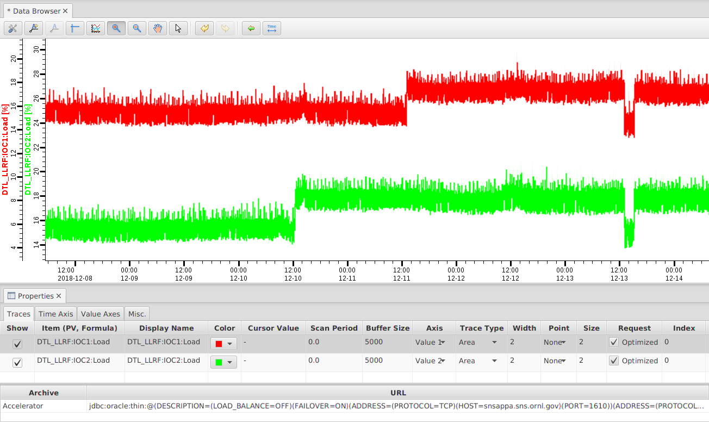
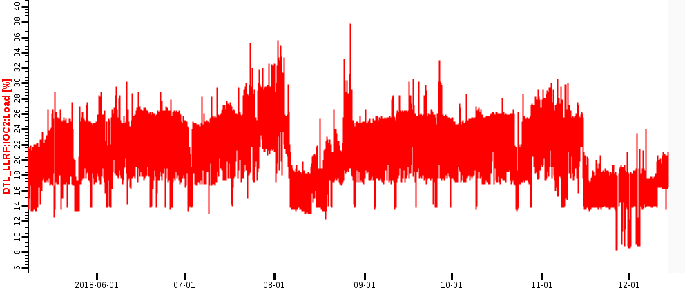

Data Browser
============

Overview
--------

The Data Browser is a trending tool. It can display the values
of 'live' Process Variables (PVs) as well as historic data in a
Stripchart-type plot over time.

Live Data
    For each PV, the Data Browser collects 'live' samples from the
    control system and plots them over time. The size of the live sample
    buffer is configurable, as is the sample period.

Historic Data
    The Data Browser queries archive data sources for historic
    samples to obtain data for time ranges 'before' the live sample
    buffer. You can configure one or more archive data source for each PV.

Getting Started
---------------

To create a new plot:

 1. Invoke the menu ``Applications``, ``Display``, |databrowser| ``Data Browser``.
 2. Open the plot's context menu by right-clicking into the plot,
    invoke |add| ``Add PV``.
 3. Enter the desired PV name, press "OK".

.. |databrowser| image:: images/icon_databrowser.png

Toolbar
-------

Open the plot's tool bar by right-clicking into the plot,
then invoke |toolbar| ``Show Toolbar``.

.. |toolbar| image:: images/icon_toolbar.png

Stagger
^^^^^^^

The |stagger| ``Stagger`` button will set the range of each value axis
such that the traces on different axes don't overlap.
In other words, all the traces of the first value axis will appear on top,
followed by the traces on the second axis below,
the traces on the third axis below the second axis and so on.

Zooming
^^^^^^^

The buttons to |zoom_in| ``Zoom In`` and |zoom_out| ``Zoom Out``
activate the respective zoom mode.

While in ``Zoom In`` mode,

 * pressing the mouse on a start point in the time axis,
   then dragging to an end point in the time axis
   and finally releasing the mouse button will zoom into the
   selected time region.
 * similarly selecting a start..end range on a value axis
   will zoom into the selected range on that value axis.
 * dragging a rectangle inside the plot will zoom into the selected region

While in ``Zoom Out`` mode,

 * clicking the mouse on the time axis
   zooms out of that point in time.

 * clicking the mouse on a value axis
   zooms out of that value on that axis.

 * clicking the mouse inside the plot
   zooms out of that point on the
   time axis and all value axes.

``Zoom In`` can also be activated within the plot by simply holding
the ``Control`` key, then dragging a range on the time axis,
value axis or within the plot.

Finally, while the mouse pointer is within an axis or the plot,
you can hold the ``Control`` key and then use the scroll wheel
to zoom in or out of an axis or the plot.

Property Panel
--------------

Open the plot's property panel by right-clicking into the plot,
then invoke |properties| ``Open Properties Panel``.

The panel allows you to configure each trace, the time axis, the value axes,
and miscellaneous settings.

Live Data Sampling 
^^^^^^^^^^^^^^^^^^

By default, traces will use a ``Scan Period`` of 0 seconds, which means
we keep every sample received from the control system.
To avoid running out of memory, the live data buffer has a limited
``Buffer Size``.
For example, if your channel updates every 1 second, and the buffer size
is set to 5000, the data browser will keep roughly the last 1 hour and 20 minutes
of live data in memory. Older samples are dropped.

To keep a longer time span of live data in memory, you can increase the ``Buffer Size``,
which obviously results in using more memory. Alternatively, you can set the ``Scan Period``
to for example 5 seconds. This will ignore the update rate of the channel and simply take
a sample every 5 seconds, allowing a buffer of 5000 samples to hold almost 7 hours of data.  

Optimized vs. Raw Archive Data Request
^^^^^^^^^^^^^^^^^^^^^^^^^^^^^^^^^^^^^^

By default, a trace will request ``Optimized`` data from an archive.
How this is accomplished depends on the implementation of the underlying
archive system. The fundamental idea is that the data browser
requests a reduced (optimized) set of min/max/average samples.
The number of optimized samples is based on the width of the screen in pixels.
When using 'Area' traces as shown below, the average values are
plotted as a line, and the min/max outline is displayed as a
light-colored area. This not only reduces the amount of data compared
to plotting every single raw sample from the archive. In addition it
makes it obvious if a value was fairly stable over time, or if there
was a lot of movement in the data around the average.
Some archive data sources may also provide the standard deviation,
which will be represented as a pair of thinner lines,
one above and one below the thicker average line.

.. image:: images/optimized.png
   :width: 80%
   :align: center

When there are fewer 'raw' data points than requested,
the 'Optimized' algorithm falls back to returning the raw data, meaning:
When you zoom into the data far enough, you will eventually get raw data.

You may use the ``Request`` option ofproperty  a trace in the property panel
to always request ``Raw`` data.
As a result, each original sample is fetched from the archive.
The screenshot below shows the result.
Not only is this usually a larger amount of samples, taking longer to receive and then
to plot. It also uses more memory, and when you try to look at raw
data for a long time range your computer will eventually ran out of
memory. The 'Raw Data' requests should therefore only be used when
necessary because of shortcomings in the 'Optimized' algorithm.

Trace Types
^^^^^^^^^^^

Ideally, control system data is only updated when it changes by
a significant amount. EPICS records actually offer separate update
thresholds for live and archived data, so that live displays can
receive updates for small changes at the noise level of a signal,
while historic data is only written for changes well above the noise
level.

When the Data Browser receives either live of historic samples,
we assume that those represent significant changes in the value.

The "Area" and "Single Line" Trace Types,
shown to the left in the following image,
use a stair-step type of line that holds the value of the last sample
until a new sample arrives.
This reflects our assumption that the signal has not significantly changed
until we receive a new sample.

 .. image:: images/stair.png
 .. image:: images/direct.png 

The alternate "Area (direct)" and "Single Line (direct)" Trace Types,
shown to the right,
draw a direct line between samples, suggesting a linear change
of the process variable between known samples.

Exporting Data
--------------

Use the "Export" panel to write data into files suitable
for spreadsheet programs or Matlab.
Open the export panel by right-clicking into the plot,
then invoke |export| ``Open Data Export Panel``.

Time Range
    By default, the export will use the time range from the plot,
    but you can export data for a different time range.

Source Options
    By default, the export will fetch raw data from the archive,
    not the optimized, reduced min/max/average data that is displayed in the plot.
    
    You can modify the time range of the export to differ from the range of the plot,
    and also select to export either the exact data that is displayed in the
    plot, or request optimized data with a different number of "bins" from
    the archive.

    ``Plot``: The exact samples currently displayed in the plot
    will be exported.
    
    ``Raw Archived Data``: The exported data will contain data that
    is requested from the archive without modifications.
    
    ``Optimized Archived Data``: To reduce the number of exported
    samples, optimized data is requested from the archive. You specify
    the number of desired samples, and the export will then request
    roughly this number of averaged samples from the archive data source.
    For example, when requesting 800 optimized samples, the
    start..end time range is split into 800 "bins". The the minimum,
    maximum and average value of the raw samples within each bin is then
    exported.
    
    ``Linear Interpolation``: As an alternative way to reduce the
    number of exported samples, the exported samples are computed via
    linear interpolation from the raw data. You specify the interpolation
    interval in hours, minutes and seconds, for example 00:10:00 to
    obtain one sample every 10 minutes.

    
Format Options
    The format of the exported file defaults to a spreadsheet
    suitable for import into most spreadsheet programs. You can modify
    these settings:
  
    ``Tabular``: Instead of a table that lists the samples for all
    channels, you can export the samples for each channel separately.
    
    ``.. with error columns``: The min...max range of optimized data
    is by default exported as "error" columns, suitable for an error-bar
    display.
    
    ``.. with Severity/Status``: The Severity and Status of each
    sample is by default exported, but you can omit it if not needed.
 
    ``Default format``: The number of decimal digits will be
    obtained from the data source.
  
    ``Decimal format``: You specify the number of decimal digits.
   
    ``Exponential notation``: Use exponential notation, where you
    again specify the number of decimal digits.
   

Excel Spreadsheets
^^^^^^^^^^^^^^^^^^

The exported data files are in a text format with TAB-delimited
columns suitable for import into spreadsheet programs like Microsoft
Excel.

Assume you chose a filename of "test.dat" on your Desktop,
follow these steps for import into Excel:
 
 * In Excel, use File/Open to open the file "test.dat".
   You might have to select ``Files of type: All Files (*.*)`` in the file
   "Open" dialog to do this.
 * A "Text Import Wizard" should appear, and the default
   settings should already be set to
   
   * "Delimited - Characters such as ... tabs ..."
   * "Delimiters: Tab"
   
 * Even though the time stamp column contains the full date and time,
   Excel will only display time down to minutes,
   omitting the seconds or microseconds.
   Fix this by clicking on the "A" table header, i.e. selecting the whole first column;
   right-click to get the "Format Cells..." dialog, and enter a "Custom"
   format: ``yyyy/m/d h:mm:ss.000``

For plots, the "X/Y scatter" plot type using time as the X axis
and the value column for the Y axis tends to work best.

Note that Excel is limited to about 65000 lines. If your data
file includes more lines, those will be lost in the import. You can
work around this by exporting a smaller time range into separate
files, or by exporting averaged data.

The value columns for averaged data will contain text like "5 [0... 10]"
to indicate that the average value for that time was 5, with
a minimum/maximum range of 0 to 10. To perform computations in excel,
it might be useful to select the column and perform a text replacement
of "[*]" with "" (nothing) to delete the min/max info.

When performing computations on the data, values marked "#N/A"
which have non numerical value because they represent a status or
error should be ignored by Excel.

OpenOffice.org/LibreOffice Calc Spreadsheets
^^^^^^^^^^^^^^^^^^^^^^^^^^^^^^^^^^^^^^^^^^^^

As long as the exported data file has a ".csv" suffix,
OpenOffice.org/LibreOffice should open the file with an "import"
dialog similar to MS Excel, where you select "tab" delimited columns
as explained above.
        
File names ending in ".dat", ".txt" etc. might only open in the
OpenOffice.org/LibreOffice Writer (word processor), so you have to use
the correct file suffix.

Matlab
^^^^^^

The Matlab export can use two different file formats.
To create binary Matlab data files, use a file name ending in ``.mat``.
Matlab text files are created when the file name ends in ``.m``.

The binary data file like "example.mat" is suitable for loading
into Matlab 5 and newer like this::

    load /path/to/the/example.mat

In your Matlab workspace you should then find structures named
"channel0", "channel1", ..., one for each channel that was loaded from
the file. Each structure has the following elements:

``name``: Channel name

``time``: Time stamps

``value``: Numeric value

``severity``: Severity

The time stamps are saved as text. In reasonable modern versions
of Matlab you best convert them to Matlab serial date numbers, which
you can then for example plot over time like this::

    channel0.date = datenum(channel0.time, 'yyyy-mm-dd HH:MM:SS.FFF');
    plot(channel0.date, channel0.value);
    datetick('x',0);
    title(channel0.name);

The Matlab text files like "example.m" are suitable for loading (executing)
in Matlab R2006b or newer, creating one 'timeseries'
object per trace. To load it into Matlab, you execute the file like this::

    cd /path/to/the/file
    example

Matlab will then execute the commands in the file which define
the data in the Matlab workspace and also plot it. With Matlab
releases older than R2006b you will have to edit the generated file to
suit your needs, for example use simply ``plot(v)`` to show the values.

Command Line Export Options
^^^^^^^^^^^^^^^^^^^^^^^^^^^

The export functionality can also be invoked from the command line,
without using the graphical user interface.
This can be convenient when regularly exporting data for several channels.

To see available options, run phoebus like this::

    phoebus -main org.phoebus.archive.Export -help
    
    Usage: -main org.phoebus.archive.Export [options]

    Export archived data into files

    General command-line options:

    -help                                    -  This text
    -settings settings.xml                   -  Import settings from file, either exported XML or property file format
    -archives                                -  Set archive URLs, separated by '*'

    Archive Information options:
    -list [pattern]                          -  List channel names, with optional pattern ('.', '*')

    Data Export options:
    -start '2019-01-02 08:00:00'             -  Start time
    -end '2019-02-03 16:15:20'               -  End time (defaults to 'now')
    -bin bin_count                           -  Export 'optimized' data for given bin count
    -linear HH:MM:SS                         -  Export linearly extrapolated data for time intervals
    -decimal precision                       -  Decimal format with given precision
    -exponential precision                   -  Exponential format with given precision
    -nostate                                 -  Do not include status/severity in tab-separated file
    -export /path/to/file channel <channels> -  Export data for one or more channels into file

    File names ending in *.m or *.mat generate Matlab files.
    All other file name endings create tab-separated data files.
