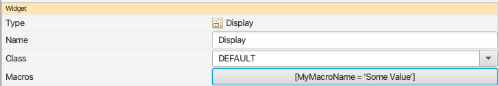
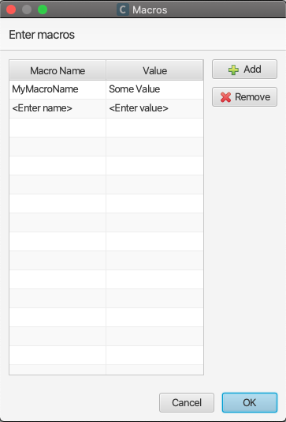
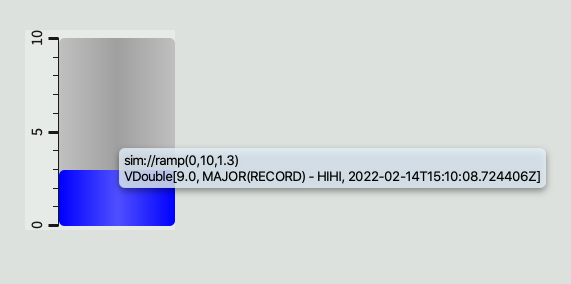
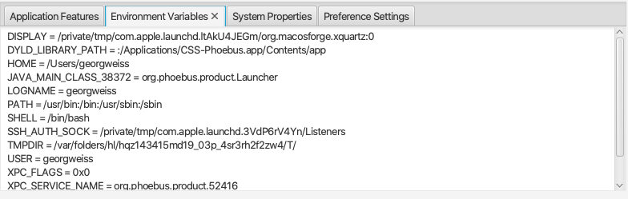
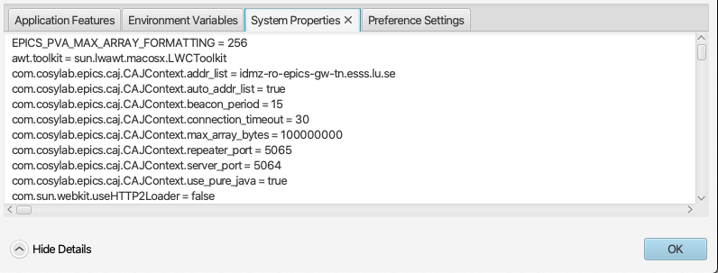

======
Macros
======

Macros can be used for string replacement in a variety of use cases. A common use case is to define macros as substrings of PV names used
in displays controlling multiple instances of the same type of hardware.

The macro format can be either **$(macro_name)** or **${macro_name}**. Letters and numbers can be used for macro names,
but a macro name must must start with a letter. Macro names are case sensitive.

There are a number of different macro types:

Symbol Macros
=============

Symbol Macros can be defined in several places.

1. On the command line when launching a display using the -resource option:

.. code-block:: python

    java -jar /path/to/application.jar -resource file:///path/to/display.bob?MyMacroValue=Some%20Value

Note that macro values must be URL encoded, e.g. space character is encoded as %20.

2. In a display file using the macro property editor:

3. A macro property editor is also available for container widgets like for instance Embedded Display, Group or Navigation Tabs.

While macros will in general propagate (e.g. from command line to Embedded Display), overrides must be considered if
the same macro - identified by name - is defined on multiple levels:

#. Macro defined in a display file will override macro defined on command line.
#. Macro defined for a container widget will override macro defined in the containing display file.

Widget Property Value Macro
===========================

This allows you to access the value of a property of the widget in run mode. In this case, the macro_name is the property id of the widget property.
For example, $(pv_name), $(pv_value), $(foreground_color).

A good example of Widget Property Value Macro is the tooltip: A tooltip of "$(pv_name)$(pv_value)" will display the PV Name and its value in run mode.

System Macros
=============

The following macros are predefined, and can be overridden by Symbol Macros:

* $(DID): The unique ID for each display. Even if there are multiple displays refering to the same physical OPI file, each display still has an unique ID. This macro is useful for avoiding name conflict. For example, if we add a prefix of $(DID)_ to a local PV name, we can easily guarantee the PV name is unique to this display.
* $(DNAME): The name of the display.

Environment Variables
=====================

A macro like $(PATH) will - unless explicitly overridden - expand to the value of the process owner's environment
variable PATH. To see the list of available environment variables, select menu option *Window->About* and then
expand *Show Details* and select *Environment Variables* tab:

System Properties
=================

Java system properties can be accessed as macros, e.g. $(os.version). The list of supported Java system
properties may vary between Java versions. To see the list of available system properties, both those defined by
the Java runtime and those defined by the application, select menu option *Window->About* and then
expand *Show Details* and select *System Properties* tab:

General Remark
==============

A macro is a string substitution mechanism, nothing else. In particular, a macro contains no type information. This
has implications if macros are referenced in rules. For instance, if compared to a string value, the
macro must be quoted. On the other hand, if compared to a numerical value, the macro must expand to a number and
be specified without quotes.
