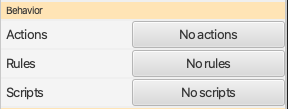
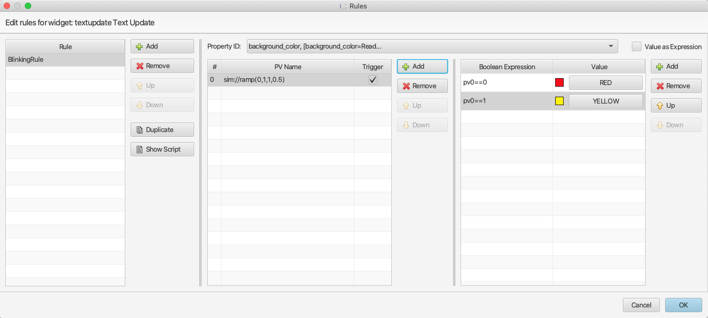
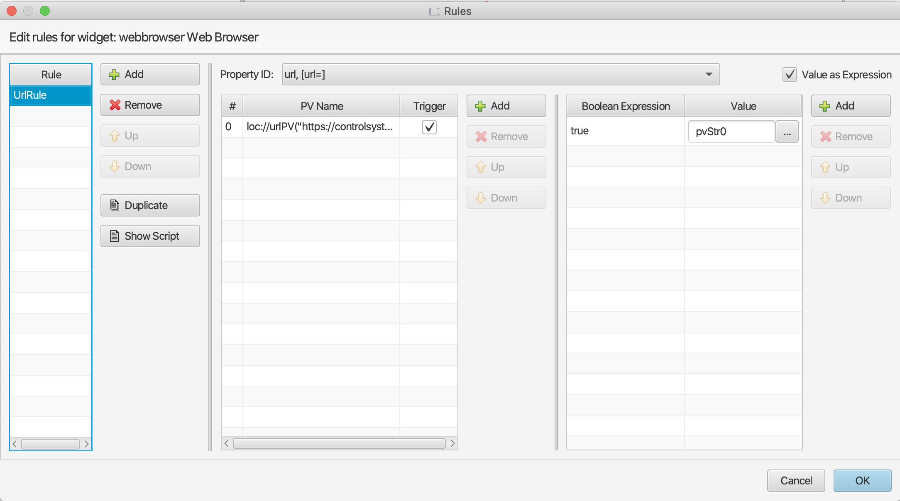

=====
Rules
=====
With rules you can change widget properties dynamically.
A widget property value will change along with the boolean expression status or input PV value.
The execution of a rule is triggered by its input PV(s), so at least one trigger PV is needed for a rule.

For more complex dynamic behavior you will need to use scripts.

Attaching rules to a widget
---------------------------

1. In the widget properties pane, click the button to launch the rules editor dialog:

2. In the rules editor you can add one or multiple rules for a widget.

- A rule must have a name, which defaults to "New Rule".

- The "Property ID" drop-down will list the widget properties that may be controlled by rules.

- The middle section lists the input PVs for the rule selected in the rule list. The check box in the "Trigger" column determines if a value change in the PV should apply the rule.

- The right-most list holds the boolean expressions and values of the widget property. When a "Boolean Expression" evaluates to ``true``, the widget property selected in the "Property ID" drop-down will be set to the value defined in the "Value" column.

- The "Show Script" button will display the script that is constructed from the rule. Any changes to the script content are ignored.

- The "Value as Expression" checkbox is explained below.

Boolean Expression
------------------

The "Boolean Expression" is JavaScript boolean expression, so all JavaScript operators are applicable here. All input PVs
of the rule are accessible in the expression.

- Numeric double values are referenced using the syntax pv{index}, e.g. pv0 > pv1.

- Numeric long and integer values are referenced using the syntax pvInt{index}, e.g. pvInt0 > pvInt1.

- String values are referenced using the syntax pvStr{index}, e.g. pvStr0 == "apple".

- A PV severity value is referenced using the syntax pvSev{index}, e.g. pvSev0 == 1. Severity values are:

    - -1 - Invalid

    - 0 - OK

    - 1 - Minor

    - 2 - Major

Value as Expression
-------------------

In addition to outputting a constant value to the property based on the boolean expression value,
you may also output an expression value to the property. For example, if you want use the string
value of a PV as the URL of a web browser widget, you can set the output expression to pvStr0.
If you want to skip the boolean expression, simply set boolean expression to ``true``.

