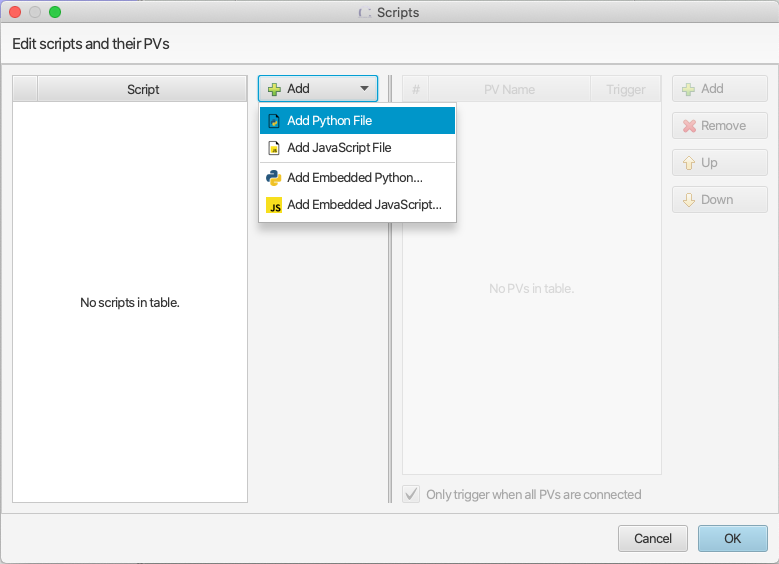
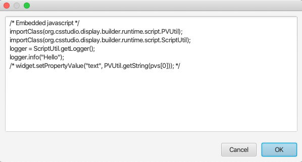
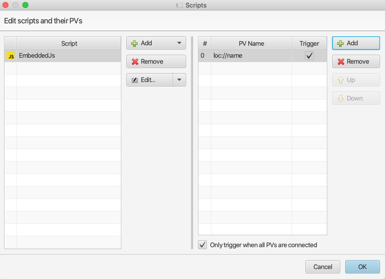

=======
Scripts
=======

    **DISCLAIMER**

    Scripting in CS Studio should be used **only** if a particular task cannot be achieved with the built-in features of
    the various widgets, or with formula functions or rules. In particular, CS Studio **should not** be used as a
    script execution platform for data processing or complex business logic. It should also be noted that each script
    referenced by the widgets of an OPI is compiled when the OPI is loaded, which adds to the overall load time,
    and which may degrade the initial responsiveness of the UI.

    Supported script language versions are Python 2.7 and JavaScript 1.7 (ECMAScript support is **very** limited).

For complex dynamic behaviors which cannot be achieved by formula functions or rules, you can attach one or more JavaScript or Python scripts
to a widget or display. Both script types accept PVs as inputs. Script execution is triggered
by the value change event of input trigger PVs, i.e. a change of PV value or timestamp.
In a script the value, timestamp or severity of the input PVs are accessible, see :ref:`access_pv_in_script`. The widget and display objects
are also accessible in script, see :ref:`access_widget` .

Both JavaScript and Python script may call Java code by importing corresponding packages. For example:

**JavaScript Example:**

.. code-block:: javascript

    importPackage(Packages.org.eclipse.jface.dialogs);
    MessageDialog.openInformation(null, "Dialog from JavaScript", "This is a dialog opened from JavaScript")

**Python script Example:**

.. code-block:: python

    from org.eclipse.jface.dialogs import MessageDialog
    MessageDialog.openInformation(None, "Dialog from Python", "This is a dialog opened from Python")

As seen above, calling Java code is very similar between JavaScript and Python. Most script examples in this help document are in JavaScript,
but it should be easy for you to translate them to Python. For example, here are two code snippets written in JavaScript and Python respectively.
The functionality in the scripts is identical.

**JavaScript Example:**

.. code-block:: javascript

    importPackage(Packages.org.csstudio.opibuilder.scriptUtil);
    var value = PVUtil.getDouble(pvs[0]);
    var RED = ColorFontUtil.RED;
    widget.setPropertyValue("start_angle", value);
    widget.setPropertyValue("foreground_color", RED);

**Python script Example:**

.. code-block:: python

    from org.csstudio.opibuilder.scriptUtil import PVUtil
    from org.csstudio.opibuilder.scriptUtil import ColorFontUtil
    value = PVUtil.getDouble(pvs[0])
    RED = ColorFontUtil.RED
    widget.setPropertyValue("start_angle", value)
    widget.setPropertyValue("foreground_color", RED)

**Steps to attach scripts to a widget:**

1. In the widget properties pane, click the button to launch the script editor dialog:

.. image:: images/RulesButton.png

2. In script editor dialog you can add one or multiple scripts. A script may be either a script file on the file
system, or a code block embedded into the OPI file.

3. If an embedded script is selected, the editor will create a small script template and show it in an editor window.

4. For each script you can specify one or multiple input PVs.
PVs that trigger script execution should be checked in Trigger column. There must be at least one trigger PV for each script.

Internals
---------

.. raw:: html

   <a href="html/generated/index.html">Java Doc for scripts</a>