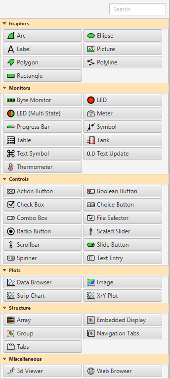

=======
Widgets
=======

The Display Builder application supports a set of widgets which can be used to create control GUIs. The widgets are
organized according to the categories *Graphics*, *Monitors*, *Controls*, *Plots*, *Structure*, and *Miscellaneous*:

Each category corresponds to an intended use case of the widgets belonging to the category:

.. list-table::
   :widths: 30 70
   :header-rows: 1
   :align: center

   * - Widget Category
     - Intended Use Case

   * - `Graphics`
     - Static graphical elements

   * - `Monitors`
     - Displaying values from PVs

   * - `Controls`
     - Writing values to PVs

   * - `Plots`
     - Plotting PV values

   * - `Structure`
     - Grouping widgets and embedding displays

   * - `Miscellaneous`
     - 3D Viewer, Web Browser

.. toctree::
   :maxdepth: 1

   widgets_properties
   widgets_classes
   widgets_order