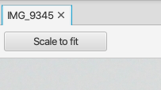

Image Viewer
============

Overview
--------

As the name suggests, the Image Viewer renders an image file at full resolution
in a separate tab in the main window. The tab title shows the image file name.

Using the "Scale to fit" button user may rescale the non-SVG images to fit to the current size of the view. The resizing
process will honor the aspect ratio of the image, i.e. the resulting view may show empty space
above/below the image, or to left/right of the image. Pressing the button again will switch back to showing the
image at full resolution. It should be noted that if the image is smaller than the current size of the view,
pressing the "Scale to fit" button will zoom in on the image.

There is no menu entry for the application. It is launched automatically for instance
when user double clicks on an image file in the File Browser, or when user clicks on
an image in the log entry attachment viewer.

Supported file types are png, jpg (jpeg) and gif. The application also supports Scalable Vector Graphics
files, but user should keep in mind that SVG tools may generate incompatible files.

If user has configured an external application for a particular image file extension, this is
NOT overridden by the Image Viewer application.