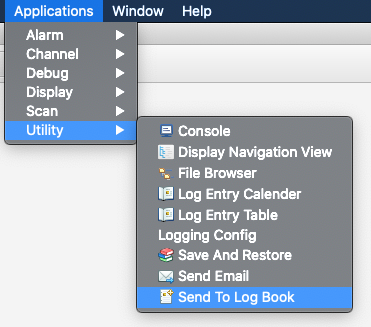

Olog
====
Olog is an electronic logbook client for the logbook service maintained here: https://github.com/Olog/olog-es.

**NOTE**: this is an optional module. For information on how to build a site specific product, see
https://github.com/ControlSystemStudio/phoebus/tree/master/phoebus-product.

Features
--------
- Arbitrary number of "logbooks", configured in the service. A logbook entry is contained in one or several logbooks.

- Arbitrary number of "tags", configured in the service. A logbook entry may be associated with zero or several tags.

- Arbitrary number of "properties", configured on the service. A property is a named list of key/value pairs. The user may define values for the items in a property. A logbook entry is associated with zero or several properties.

- Arbitrary number of attachments, i.e. images or other file types.
  
- Markup as defined by the Commonmark specification (https://commonmark.org).
  
- Log entry editor invocation from context menu whereby context specific attachments or data are automatically appended to the log entry.

- Log entry viewers offer search capabilities based on meta data and content.

Launching the log entry editor
------------------------------
To launch the log entry editor, the user may select Applications -> Utility -> Send to Logbook from the menu:



The log entry editor may also be launched from context menus, where applicable. For instance, with a right click on
the background of an OPI the launched context menu will include the Create Log item:

.. image:: images/ContextMenu.png
The Create Log context menu item is available also in a Databrowser plot area.

Editing a log entry
-------------------
The log entry editor is a non-modal dialog:

.. image:: images/LogEntryEditor.png

Mandatory data are:

- Username and password, see also preferences_.
  
- Title
  
- At least one logbook, see also preferences_. Additional logbooks - configured in the service - can be added from a list shown when pressing the down button:

.. image:: images/LogbookSelection.png

The body text of the log entry can be styled using markup as defined by the Commonmark specification
(https://commonmark.org). The Markup Help button will launch the system default browser to display a quick
reference.

Attachments
-----------
When the log entry editor is launched from a context menu, a screen shot is automatically appended, where applicable.
Additional images (or other type of attachments) may be added by expanding the Attachments editor:

.. image:: images/Attachments.png
Here user may attach any number of files of arbitrary types:

- ``Add Files`` will launch the native file browser dialog from which user may select any number of files.
- ``Clipboard`` will attach the file - if any - currently copied to the host OS clipboard.
- ``CSS Window`` will attach an image of the current application window.
- ``Embed New`` will launch the dialog to embed an image to the log entry body, see below.
- ``Embed Selected`` will embed user selected image files previously added to the list of attachments.

**NOTE**: The Olog service will not accept upload of attachments larger than the configured limit of 50MB. The Olog service
can be configured to use a different limit, but users should keep in mind that download of large attachments to
the log viewer may incur delays in terms of UI updates.

Embedded images
---------------
Images may be embedded in the body text using markup. The user should consult the quick reference (Markup Help button)
for details on how to do this. In general, users should use the Embed Image button to add image markup at the cursor position:

.. image:: images/EmbedImage.png
External image resources may be edited manually, e.g.:
````. 
File URLs are not supported.

Properties
----------
Properties are edited by expanding the Properties editor. The below screen shot shows that one single property
(LCR shift info) holding five keys has been configured in the service:

.. image:: images/PropertiesEditor.png
User may select what properties to include in the log entry, and edit the values for the items in the property.


Log entry viewer
----------------
The menu item Applications -> Utility -> Log Entry Table will launch an application (in a new tab) in which the user may
search and view log entries:

.. image:: images/LogEntryTable.png
In the search field the user may specify criteria when searching for log entries. These criteria are based on 
the elements of a log entry as follows:

- ``desc`` or ``description``: The body text, whereby any markup characters are ignored. The search is case insensitive.

- ``title``: The title of the log entry. The search is case insensitive.

- ``level``: The value of the Level field.
  
- ``logbooks``: A comma separated list of logbook names. Log entries contained in either of the listed logbooks will match.

- ``tag``: A comma separated list of tag names. Log entries tagged with either of the listed tags will match.

- ``owner``: The author of a log entry as specified in the Username field when the entry was created.

- ``start``: Defines the start date limit in a search. Time may be specified using the format ``yyyy-MM-dd HH:mm:ss.SSS`` or a relative time like "8 hours" or "2 days".

- ``end``: Defines the end date limit in a search. Time may be specified using the format ``yyyy-MM-dd HH:mm:ss.SSS`` or a relative time like "8 hours" or "2 days". The value "now" is supported.

- ``properties``. Both property names as well as key name and value of the items in a property can be searched like so:

    - ``properties=property name`` find log entries containing a property named "property name"

    - ``properties=property name.key name`` find log entries containing a property names "property name" and that contains a key named "key name".

    - ``properties=property name.key name.value`` find log entries containing a property named "property name" and that contains a key named "key named" with a value of "value".

    - ``properties=property name 1|property name 2`` find log entries containing a property named "property name 1" **or** a property named "property name 2". The pipe character is used to separate search expressions.

Pagination
^^^^^^^^^^

Each search request will retrieve a limited number of matching log entries to render in the list view. This limit
- aka "page size" - defaults to 30, but may be changed by a property value override. In addition, user may override the
default page size in the UI. Page size must be between 1 and 999. If the search results in a hit count larger
than the page size, the UI will render page navigation buttons below the list of log entries. The current page and
total number of pages is also shown, see screen shot.
The navigation buttons are not rendered if the search results in less than two pages.

.. image:: images/pagination.png

.. _preferences:

Attachment Preview
------------------

When viewing a log entry, attachments are listed in the attachments view. A preview of an image attachment is shown
when user selects it. To see the attachment in full resolution, user may click on the preview image, or double-click
in the attachment list.

If user double-clicks on a OPI file attachment (.bob file), the application will launch that OPI in run mode.

If user double-clicks on a Data Browser attachment (.plt file), the application will launch the Data Browser.

Preview of non-image files is not offered in the application. However, external viewers may be configured for
arbitrary file extensions, see preference_settings_ (framework.workbench) for more information.

Preferences
-----------
Preferences related to the electronic logbook are the following:

- ``org.phoebus.olog.es.api/olog_url``. This should be on the format ``http(s)://foo.com/Olog``, where the path element ``Olog`` may not be omitted.

- ``org.phoebus.logbook.olog.ui/default_logbooks``. This is a comma separated list of logbooks automatically associated with a new log entry.

- ``org.phoebus.logbook.olog.ui/level_field_name``. The text shown next to the drop-down below the password field. Sites may wish to customize this to override the default value "Level".

- ``org.phoebus.olog.es.api/levels``. List of items shown in the "Level" drop-down.
  
- ``org.phoebus.logbook.ui/save_credentials``. Indicates if user credentials should be cached. If ``true``, the user will
  have to specify credentials only for the first new log entry after launch of CS Studio. The side effect of credentials caching is that all entries will be created with the same user (owner) identity.

- ``search_result_page_size``. The maximum number of hits per page to fetch and render in a search. User may override in the UI. Value must be 1 - 999, default is 30.


