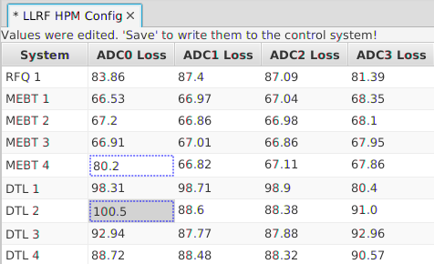

PACE: PV Adjust, Confirm, ELog
==============================

The PACE Editor provides a tabular view of Process Variables (PV) names and their current values.

The user can edit the values, review the changes, revert changes,
and finally write changes back to the PVs with an automated electronic logbook (ELog)
entry that lists the modified PVs and their values.

It is ideally suited to maintain critical setting PVs for a list of identical systems
where each instance of a system has the same PVs, so these PVs can be shown in columns
of a table.
Changes to the PVs are documented via log entries.

The PV changes and the associated logbook entry are as much as possible treated as one transaction:
PV writes are only attempted after a successful logbook entry.
If the logbook entry fails, PVs are restored to their original value.

   
    PACE

Starting PACE
-------------

PACE is opened whenever a ``*.pace`` configuration file is opened,
for example via a double-click in the file browser.

Using PACE
----------

When a ``*.pace`` configuration file is opened, the table displays
the current value of PVs.
Except for columns marked as read-only in the configuration file
(which is also indicated via the cell tool-tip),
cell values can be edited.

Modified cells are indicated via a border.

The context menu allows restoring modified cells to their original value.
The context menu can also be used to set several selected cells to the same value.

Finally, there are two options:
You can commit the modified cell values to the respective PVs,
or abandon the changes.

When trying to close a modified PACE table, a dialog will ask if you want to save the changes.
Alternatively, you can also invoke the File/Save menu item.

A logbook submission dialog will appear, populated with information about the modified cells.
When it is submitted, the PVs will be written.

To abandon the changes, simply close the PACE table and answer "No" when prompted if
changes should be saved.

Configuration File
------------------

Configuration files in the ``*.pace`` format are typically prepared
by control system personell, but end users may also create them.
A PACE file uses an XML format with the following basic structure::

    <paceconfig>
      <title> Your Title goes here  </title> 
      <columns/>
      <instances/>
    </paceconfig> 

The columns section describes the columns of the PACE table.
Each column has a name, optional access mode, and a macroized PV pattern::

    <columns>
      <column>
        <name>Column Header</name>
        <access>rw</access>
        <pv>${S}_RCCS:CV${N}02:PID_KP</pv>
      </column>
      <!-- There can be more columns -->
    </columns>

The cell access can be rw for read-write or ro for read-only.
The PV name for the cell contains macros either written as ``$(macro)`` or ``${macro}``.
Replacement values for the macro variables are defined below under instances.

The column definition can have meta-PVs in addition to the main PV.
These are meant to contain the data, user name and comment associated to the last change of the main PV.
They are defined via tags similar to the main PV::

        <!-- PV as before, but now followed by meta PVs:
        <pv>${S}_RCCS:CV${N}02:PID_KP</pv>
        <name_pv>${S}_RCCS:CV${N}02:PID_Name</name_pv>
        <date_pv>${S}_RCCS:CV${N}02:PID_Time</date_pv>
        <comment_pv>${S}_RCCS:CV${N}02:PID_Txt</comment_pv>

The current values of these meta PVs will be displayed in the tool-tip of the cell.
The name and date meta PVs will be updated with the user name and current date when writing to the main PV.
The comment PV can be edited by providing access to it in a separate column.

Finally, each row in the PACE table is defined via instances::

    <instances>
      <instance>
        <name>DTL 1</name>
        <macros>S=DTL,N=1</macros>
      </instance>
      <!--  Many more...: DTL 1..6, CCL 1..4. -->
    </instances>

Each row starts with the name of that instance, followed by one cell for each column definition.
The macro settings are used to turn the macro-ized PV names of the column definitions into specific PV instances.

A macro can be set to empty like this::

    <macros>PV=""</macros>

If the PV name for a cell evaluates to an empty string, that cell will not have a PV.

Configuration File Example::

    <!-- Example config file -->
    <paceconfig>
      <title> Title </title>
      <columns>
        <column>
          <name>PID Gain</name>
          <access>rw</access>
          <pv>${S}_RCCS:CV${N}02:PID_KP</pv>
          <name_pv>${S}_RCCS:CV${N}02:PID_Name</name_pv>
          <date_pv>${S}_RCCS:CV${N}02:PID_Time</date_pv>
          <comment_pv>${S}_RCCS:CV${N}02:PID_Txt</comment_pv>
        </column>
        <column>
          <name>Comment</name>
          <access>rw</access>
          <pv>${S}_RCCS:CV${N}02:PID_Txt</pv>
        </column>
        <!-- There can be more columns -->
      </columns>
      <instances>
        <instance>
          <name>DTL 1</name>
          <macros>S=DTL,N=1</macros>
        </instance>
        <!--  Many more...: DTL 1..6, CCL 1..4. -->
      </instances>
    </paceconfig>
