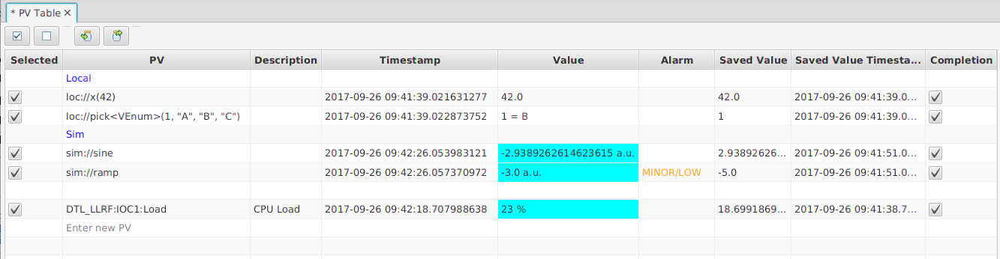

PV Table
========

The PV Table provides a tabular view of PV names and their current value with time stamp and alarm state.

You can take a "snapshot" of current values and dates, and the table will now highlight rows
where the current value differs from the snapshot.

The configuration (PV names, saved value, saved date) can be saved and later re-loaded,
see details on the file format described below.

   
    PV Table

Adding and Removing PVs
-----------------------

The simplest way is to enter new PV names in last row of table.

To insert a new PV in the middle of the table, open the context menu on
the desired table row and select "Insert Row (above)" to add a row above,
then change the PV name of the new row.

Finally, you use drag-and-drop to move existing rows within the table,
or to 'drop' PV names into the table from tools that support dragging PV names.

Delete PV names by changing their name to an empty name,
or by selecting one or more PVs and deleting them via the context menu.

Comments
--------

PV names that start with "# " are considered a comment.
This can also be used to add empty lines into the table by entering just "#" as a PV name.

Checking PVs for Snapshot/Restore
---------------------------------

By default, the check mark at the start of each table row is set.
When taking a snapshot of current values or restoring PVs to the snapshot,
this typically applies to rows where the check mark is set.

You can un-check table rows if they should be excluded.
The context menu of the table offers shortcuts to select or de-select the whole table.

In addition, the context menu also allows taking a snapshot or restoring the
row on which the context menu was invoked, which can be useful to operate on just
one PV and not the whole table.

Restoring PVs
-------------

The value of PVs can be restored, i.e. the saved value will be written to the PV.
By default, this affects every row of the table, but the check-mark at the start
of each table row can be use to de-select rows.

Completion
----------

By default, saved values are restored to PVs by simply writing to them.
When checkbox in the "Completion" column is selected for an PV,
the saved value will be restored by using the "Put-Callback" method of writing,
awaiting the completion of the write.
This can be useful with PVs that support put-callback,
a typical example being motors.

The PV Table has one global timeout that is used for each write operation that
uses completion. It defaults to 60 seconds and can be changed via the
"Completion Timeout" option in the context menu.

Tolerance
---------

Values are highlighted when they differ from the saved snapshot value by a certain amount.
The currently used tolerance is displayed in the tool-tip of a table row.
This 'tolerance' value can be configured via the context menu of selected table rows.

When configuring the 'tolerance', note that it applies to the rows which are
selected in the table via the usual selection mechanism (click on one row, shift-click to select multiple rows, ...).
If no row specific rows are selected to set their tolerance, the tolerance for every row in the table will be updated.
This is independent of the check mark in the first table column which marks rows to be restored by writing
their saved value back to the PVs.

File Formats
------------

The original PVTable file format uses a ".pvs" extension for its file names.
The files have an XML format which is described by the <file>pv_table.xsd</file>
contained in the PV Table sources.

Since version 4.0.0, the PVTable also supports file format
used by the EPICS synApps ``autosave`` module,
http://www.aps.anl.gov/bcda/synApps/autosave/autosave.html.
Whenever loading or saving a PVTable from a file with a ".sav" extension,
the autosave format will be used.

Advantages of the original PVTable ".pvs" file format:

 * Tracks which rows were selected.
 * Saves not only the value but also the timestamp of saved values.
 * Contains global as well as per-element 'tolerance'.
 * Allows using 'completion'.
 * Best for standalone operation of the PVTable.

Advantages of the autosave ".sav" file format:

 * It can be used by the IOC to load/save settings.
 * PVTable allows easy comparison of last settings written by IOC against current values.
 * Best for use together with on-demand save/restore on the IOC.

