Queue Server
============

Overview
--------

The Queue Server application provides a graphical interface for the
`Bluesky Queue Server <https://blueskyproject.io/bluesky-queueserver/>`_,
allowing users to manage experiment queues, edit plans, control execution,
and monitor status at beamlines and scientific facilities.

It communicates with the Queue Server's HTTP API and optionally
uses WebSocket connections for real-time status and console streaming.

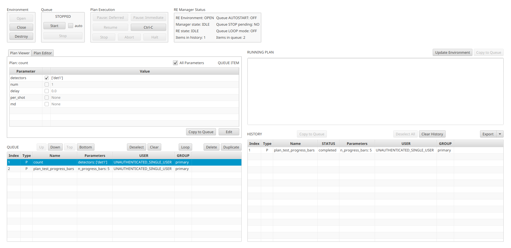

The application provides two independent views, each available
as a separate Phoebus application:

Edit & Control Queue
    Full queue management, plan editing, and execution controls.

Queue Monitor
    Read-only monitoring with collapsible panels and live console output.

Getting Started
---------------

To open the Edit & Control Queue:

 1. Invoke the menu ``Applications``, ``Utility``, ``Edit & Control Queue``.

To open the Queue Monitor:

 1. Invoke the menu ``Applications``, ``Utility``, ``Queue Monitor``.

Both applications connect to the same Queue Server instance
and share connection state. Connecting in one application
automatically connects the other.

Configuration
^^^^^^^^^^^^^

Set environment variables before launching Phoebus to configure
the connection:

.. code-block:: bash

    # Queue Server HTTP address (default: http://localhost:60610)
    export QSERVER_HTTP_SERVER_URI=http://localhost:60610

    # API key for authentication
    export QSERVER_HTTP_SERVER_API_KEY=your_api_key

    # Or point to a file containing the API key
    export QSERVER_HTTP_SERVER_API_KEYFILE=~/.phoebus/qserver_api_key.txt

Alternatively, configure via **Edit > Preferences > Queue Server**.

Starting a Local Queue Server
^^^^^^^^^^^^^^^^^^^^^^^^^^^^^

Use the provided Docker setup for local development:

.. code-block:: bash

    cd services/bluesky-services
    docker-compose --profile container-redis up -d

This starts:

- Bluesky Queue Server (RE Manager) on ports 60615/60625
- HTTP Server REST API on port 60610
- Redis database on port 6380

For details, see ``services/bluesky-services/README.md``.

Edit & Control Queue
--------------------

The Edit & Control Queue provides the full interface for managing
the plan queue and controlling experiment execution.

The top of the window contains four control panels arranged
left to right:

- **Environment** -- Open, Close, and Destroy the RE environment
- **Queue** -- Start/Stop queue execution with autostart checkbox
- **Plan Execution** -- Pause, Resume, Ctrl-C, Stop, Abort, and Halt controls
- **RE Manager Status** -- Live status grid showing environment state,
  manager state, RE state, queue/history counts, autostart, stop pending,
  and loop mode

Below the control panels, the window is split into two columns:

Left Column
^^^^^^^^^^^

**Plan Manager** (top-left) -- A tabbed panel with two tabs:

- **Plan Viewer** tab: Displays the parameters of the selected queue item
  in a table with Parameter, checkbox, and Value columns.
  An "All Parameters" checkbox toggles between showing only modified
  parameters and all parameters including defaults.
  Buttons at the bottom: ``Copy to Queue`` and ``Edit``.

- **Plan Editor** tab: Select between Plan and Instruction using radio buttons,
  then choose a specific plan from the dropdown. Edit parameter values
  in the table. Buttons at the bottom: ``Batch Upload``, ``Add to Queue``,
  ``Save``, ``Reset``, and ``Cancel``.

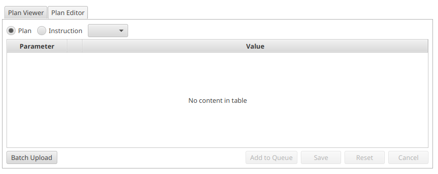

**Plan Queue** (bottom-left) -- Table showing queued items with columns:
Index, Type, Name, Parameters, USER, GROUP.
Toolbar buttons: ``Up``, ``Down``, ``Top``, ``Bottom``, ``Deselect``,
``Clear``, ``Loop`` (toggle), ``Delete``, ``Duplicate``.

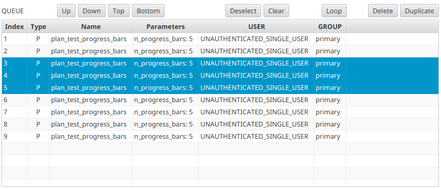

Right Column
^^^^^^^^^^^^

**Running Plan** (top-right) -- Shows the currently executing plan
as formatted text. Buttons: ``Update Environment`` and ``Copy to Queue``.

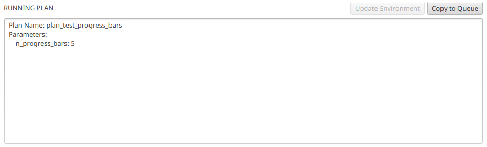

**Plan History** (bottom-right) -- Table of completed plans with columns:
Index, Type, Name, STATUS, Parameters, USER, GROUP.
Toolbar buttons: ``Copy to Queue``, ``Deselect All``, ``Clear History``,
and ``Export`` (split button with TXT, JSON, and YAML options).

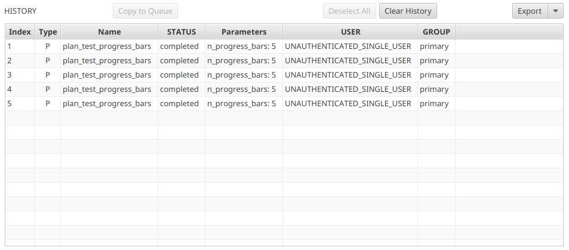

Queue Monitor
-------------

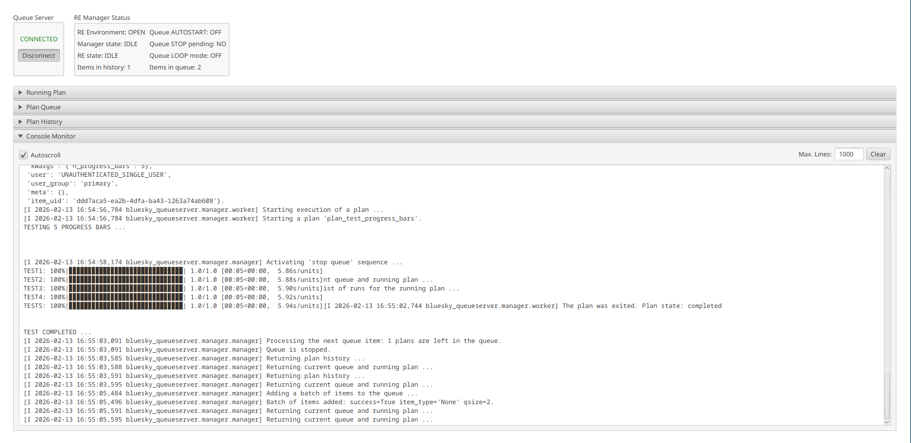

The Queue Monitor provides a compact, read-only view of the queue state,
suitable for wall displays or passive monitoring.

The top of the window shows:

- **Queue Server** connection widget (left) with status label and
  Connect/Disconnect toggle
- **RE Manager Status** grid (right) with the same status fields
  as the Edit & Control view

Below the top bar, four collapsible ``TitledPane`` sections
are stacked vertically:

- **Running Plan** (collapsed by default) -- Same running plan display
- **Plan Queue** (collapsed by default) -- Read-only queue table
- **Plan History** (collapsed by default) -- Read-only history table
- **Console Monitor** (expanded by default) -- Live console output

Expand or collapse each section by clicking its header.

Connection Widget
-----------------

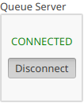

The connection widget shows the current connection status and provides
a toggle button to connect or disconnect.

The connection status label changes color to indicate the current state:

+----------------+--------+---------------------------------------------+
| Label          | Color  | Meaning                                     |
+================+========+=============================================+
| OFFLINE        | Grey   | Disconnected, user toggled off              |
+----------------+--------+---------------------------------------------+
| CONNECTING     | Grey   | Attempting to establish connection           |
+----------------+--------+---------------------------------------------+
| NETWORK        | Blue   | Cannot reach the server (auth/network issue) |
+----------------+--------+---------------------------------------------+
| STATUS         | Red    | Connected but no status from RE Manager     |
+----------------+--------+---------------------------------------------+
| CONNECTED      | Green  | Connected and receiving status updates       |
+----------------+--------+---------------------------------------------+

By default, the widget auto-connects on startup. If the connection
is lost, it automatically attempts to reconnect every 5 seconds.

When both Edit & Control Queue and Queue Monitor are open,
they share the same connection. Toggling the connection in either
application affects both.

Environment Controls
--------------------

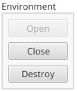

The Environment panel manages the RunEngine environment:

- **Open**: Initialize the RE environment (required before running plans)
- **Close**: Gracefully shut down the RE environment
- **Destroy**: Force-terminate the environment (use if Close hangs)

Buttons are enabled or disabled based on the current environment state.

Queue Controls
--------------

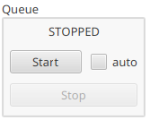

The Queue panel controls queue execution:

- **Start**: Begin executing queued plans
- **Stop**: Stop after the current plan completes
- **auto**: Checkbox to enable autostart when the environment opens

The status label shows the current queue execution state
(e.g., STOPPED, RUNNING).

Execution Controls
------------------

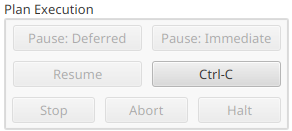

The Plan Execution panel provides fine-grained control over
the currently running plan:

- **Pause: Deferred** -- Pause at the next checkpoint
- **Pause: Immediate** -- Pause immediately
- **Resume** -- Resume a paused plan
- **Ctrl-C** -- Send interrupt signal
- **Stop** -- Stop the plan gracefully
- **Abort** -- Abort the plan immediately
- **Halt** -- Emergency halt (no cleanup)

RE Manager Status
-----------------

.. image:: images/status_monitor.png
   :width: 300
   :align: center

The status panel displays a grid of live information:

+---------------------+----------------------+
| Left Column         | Right Column         |
+=====================+======================+
| RE Environment      | Queue AUTOSTART      |
+---------------------+----------------------+
| Manager state       | Queue STOP pending   |
+---------------------+----------------------+
| RE state            | Queue LOOP mode      |
+---------------------+----------------------+
| Items in history    | Items in queue       |
+---------------------+----------------------+

Values update in real-time as status messages arrive from the server.

Console Monitor
---------------

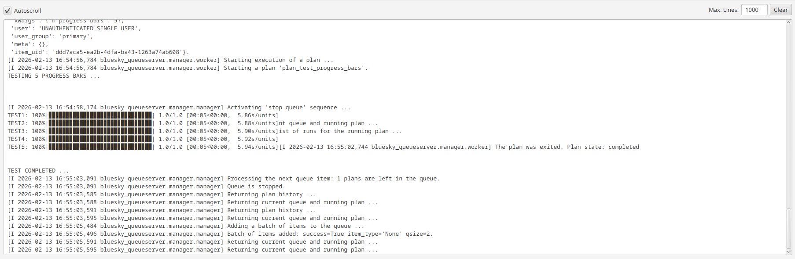

The Console Monitor streams live output from the Queue Server
via WebSocket (or HTTP polling as fallback).

Controls:

- **Autoscroll**: Checkbox to auto-scroll to the latest output (enabled by default)
- **Max. Lines**: Text field to limit the number of displayed lines
- **Clear**: Clear the console output

Plan Editor
-----------

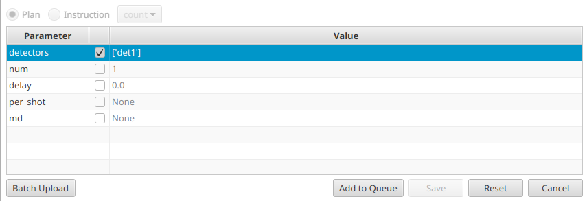

The Plan Editor tab allows creating new plans or editing existing ones.

1. Select **Plan** or **Instruction** using the radio buttons.
2. Choose a plan from the dropdown (populated from the Queue Server's
   list of allowed plans).
3. Edit parameters in the table. Each row shows the parameter name,
   a checkbox to include it, and an editable value field.

Parameter values support Python types: strings, integers, floats,
lists, dictionaries, booleans, and ``None``.

Buttons:

- **Batch Upload**: Upload plans from a file
- **Add to Queue**: Add the configured plan to the queue
- **Save**: Save edits to an existing queue item
- **Reset**: Restore default parameter values
- **Cancel**: Discard changes

Plan Viewer
-----------

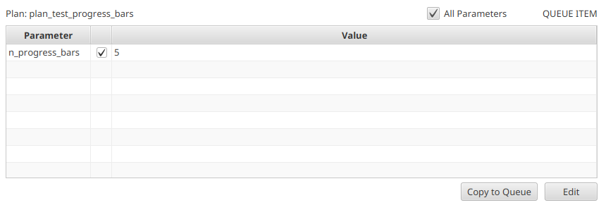

The Plan Viewer tab displays the parameters of the selected queue
or history item in a read-only table.

- **All Parameters**: Toggle to show all parameters including defaults
- **Copy to Queue**: Duplicate the item back into the queue
- **Edit**: Switch to the Plan Editor tab with this item loaded

Preferences
-----------

Configure via **Edit > Preferences > Queue Server**.

+------------------------+------------------------------------------+----------------------------+
| Preference             | Environment Variable                     | Default                    |
+========================+==========================================+============================+
| ``queue_server_url``   | ``QSERVER_HTTP_SERVER_URI``              | ``http://localhost:60610`` |
+------------------------+------------------------------------------+----------------------------+
| ``api_key``            | ``QSERVER_HTTP_SERVER_API_KEY``           | *(none)*                   |
+------------------------+------------------------------------------+----------------------------+
| ``api_key_file``       | ``QSERVER_HTTP_SERVER_API_KEYFILE``       | *(none)*                   |
+------------------------+------------------------------------------+----------------------------+
| ``use_websockets``     |                                          | ``true``                   |
+------------------------+------------------------------------------+----------------------------+
| ``update_interval_ms`` |                                          | ``500``                    |
+------------------------+------------------------------------------+----------------------------+
| ``connectTimeout``     |                                          | ``5000``                   |
+------------------------+------------------------------------------+----------------------------+
| ``debug``              |                                          | ``false``                  |
+------------------------+------------------------------------------+----------------------------+

Environment variables override preference file values.

Troubleshooting
---------------

**Connection stays at NETWORK**

- Verify the Queue Server HTTP API is running and reachable
- Check the ``queue_server_url`` preference or ``QSERVER_HTTP_SERVER_URI``
- Verify the API key is correct

**Connection shows STATUS (red)**

- The WebSocket connected but the RE Manager is not sending status updates
- Check that the RE Manager process is running on the server side

**Plans dropdown is empty**

- The environment must be open for the list of allowed plans to load
- Check the console output for error messages

**Console output not streaming**

- WebSocket streaming is preferred; verify ``use_websockets=true``
- If WebSocket fails, the application falls back to HTTP polling
  at the interval set by ``update_interval_ms``
