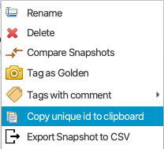

Save-And-Restore
================

Overview
--------

The save-and-restore application can be used to take a snapshot of a pre-defined list if PVs at a certain point in
time, and write the persisted values back to the IOCs at some later point.

The application depends on the save-and-restore service deployed on the network such that it can be accessed over
HTTP. The URL of the service is specified in the save-and-restore.properties file or in the settings file
pointed to on the command line.

Connection to PVs works the same as for OPI control widgets. The preference org.phoebus.pv/default will determine
how the connection will be set up (ca or pva), but user may explicitly select protocol by using scheme prefix
ca:// or pva://, e.g. ca://my_PV.

Nodes and node types
--------------------

Save-and-restore data managed by the service is arranged in a tree-like structure and hence presented using
a tree view UI component. In the following objects in the tree are referred to as "nodes". The root of the tree
structure is a folder that may only contain folder nodes. Folders may contain sub-folders or save sets, or both.
The child nodes of a save set are snapshots associated with that save set.

There are three node types managed in the application:

- **Folder**: container of other folders or save sets.
- **Save set**: a list of PV names and associated meta-data.
- **Snapshot**: the PV values read from PVs listed in a save set.

*NOTE*: If a folder or save set node is deleted, all child nodes are unconditionally and recursively deleted! The user
is prompted to confirm delete actions as deletion is irreversible.

Below screen shot shows the tree structure and a save set editor.

.. image:: images/screenshot1.png
   :width: 80%

A word of caution
-----------------

Nodes maintained in save-and-restore are persisted in a central service and consequently accessible by multiple
clients. Users should keep in mind that changes (e.g. new or deleted nodes) are not pushed to all connected clients.
Caution is therefore advocated when working on the nodes in the tree, in particular when changing the structure by
deleting or moving nodes.

Drag-n-drop
-----------

Nodes in the tree can be copied (mouse + modifier key) or moved using drag-n-drop. The following restrictions apply:
* Only folder and save set nodes can be copied or moved.
* Save set nodes cannot be copied or moved to the root folder node.
* Target node (aka drop target) must be a folder.

Checks are performed on the service to enforce the above restrictions. If pre-conditions are not met when the selection
is dropped, the application will present an error dialog.

Drag-n-drop is disabled if multiple nodes are selected and if:
* Selection contains a combination of folder and save set nodes. All selected nodes must be of same type.
* Selection contains nodes with different parent nodes. All selected nodes must have the same parent node.

Once a selection of nodes have been copied or moved successfully, the target folder is refreshed to reflect the change.

**NOTE**: Copying a large number of nodes and/or nodes with deep sub-trees is discouraged as this is an expensive operation.
Moving nodes on the other hand is lightweight as only references in the tree structure are updated.

Script Support
--------------

Basic script support for Save-And-Restore is provided in the class SaveAndRestoreScriptUtil. The available methods
require the unique id of a node in the Save-And-Restore tree structure, which can be copied to the clipboard
from the context menu:

API
^^^

**Get child nodes of a node:**

.. code-block:: python

    from org.phoebus.applications.saveandrestore.script import SaveAndRestoreScriptUtil
    print SaveAndRestoreScriptUtil.getChildNodes("<unique id of a node>")

An exception is thrown if the node id is invalid, or if the connection to the remote service fails.

**Get list of snapshot values of a snapshot:**

.. code-block:: python

    from org.phoebus.applications.saveandrestore.script import SaveAndRestoreScriptUtil
    print SaveAndRestoreScriptUtil.getSnapshotItems("<unique id of a snapshot node>")

An exception is thrown if the snapshot node id is invalid, or if the connection to the remote service fails.

**Restore a snapshot:**

.. code-block:: python

    from org.phoebus.applications.saveandrestore.script import SaveAndRestoreScriptUtil
    report = SaveAndRestoreScriptUtil.restore("<unique id of a snapshot node>", 1000, 1000, False, False)

The method signature is ``restore(snapshotNodeId, connectTimeout, writeTimeout, abortOnFail, rollback)`` where:

* ``snapshotNodeId`` is the unique id of an existing snapshot.
* ``connectTimeout`` is the timeout in ms waiting for all PVs in the snapshot to connect.
* ``writeTimeout`` is the timeout in ms for a restore/write operation.
* ``abortOnFail`` determines if the restore procedure should be aborted if restore/write of a PV fails.
* ``rollback`` determines whether to rollback if a restore/write operation fails.

This method will obtain saved PV values from the snapshot and restore them to the persisted values. The restore operation
is synchronous with respect to each PV where each write operation will wait for at most ``writeTimeout`` ms to
complete. PVs marked as read-only in the save set are not restored.

Before the restore/write operations are invoked, this method will first connect to all PVs and wait at most ``connectTimeout``
ms to complete. Once a PV is connected, its current value is read to be used if a rollback is requested.

An exception is thrown if:

* If the connection to the remote service fails.
* If the snapshot node id is invalid.
* If any of the PVs in the snapshot fails to connect within ``connectTimeout`` ms.

Upon successful completion, a RestoreReport object is returned. It contains the following fields:

* ``snapshotId``: The snapshot id.
* ``snapshotPath``: The snapshot "path" as defined by the Save-And-Restore tree structure, e.g. ``/folder1/folder2/saveset1/snapshotId``.
* ``restoreDate``: The date when the restore operation was requested.
* ``restoredPVs``: A map of successfully restored PV names and the values to which they were restored.
* ``nonRestoredPVs``: A list of PV names that could not be restored/written, if any.
* ``rolledBackPVs``: A map of rolled-back PV names and the values to which they were rolled-back. Non-null only if any write operation failed and if rollback was requested.
