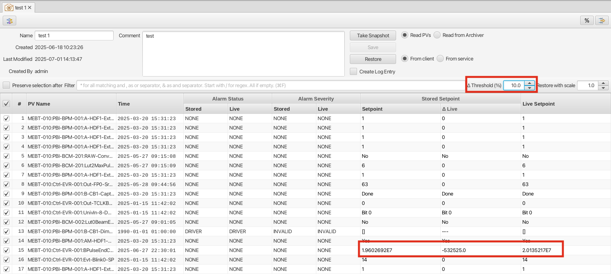
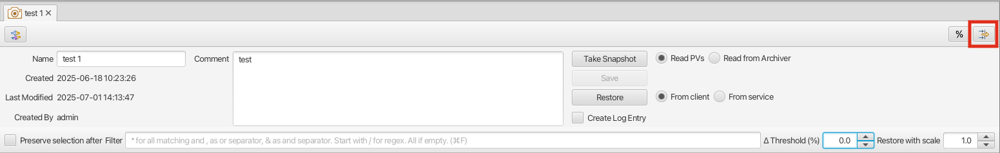
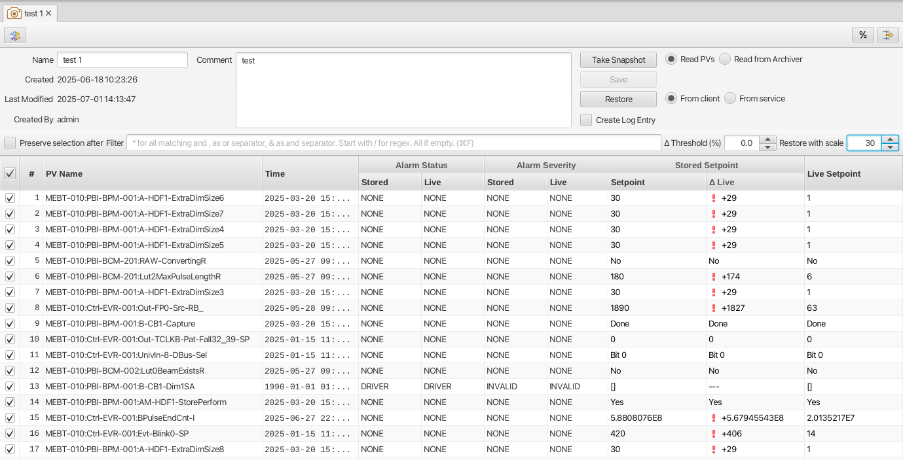

Save-And-Restore
================

Overview
--------

The save-and-restore application can be used to take "snapshots" of a pre-defined list if PVs at a certain point in
time, and write the persisted values back at some later point.

The application uses the save-and-restore service deployed on the network such that it can be accessed over
HTTP(s). The URL of the service is specified in the save-and-restore.properties file, or in the settings file
pointed to on the command line.

Nodes and node types
--------------------

Save-and-restore data managed by the service is arranged in a tree structure and hence presented in the client UI using
a tree view UI component. In the following objects in the tree are referred to as "nodes".

The root of the tree structure is a folder that may only contain folder nodes. Folders may contain sub-folders and configurationsh.
The child nodes of a configuration are snapshots associated with that configuration.

Additionally a composite snapshot node may reference an arbitrary number of snapshot or composite snapshot nodes.

There are thus four node types managed in the application:

- **Folder**: container for folders and configurations.
- **Configuration**: a list of PV names and associated meta-data.
- **Snapshot**: PV values read from PVs listed in a configuration.
- **Composite Snapshot**: aggregation of snapshots or other composite snapshots, or both.

*NOTE*: If a folder or configuration node is deleted, all child nodes are unconditionally and recursively deleted. The user
is prompted to confirm delete actions as they are irreversible.

Below screen shot shows the tree structure and a configuration editor.

.. image:: images/screenshot1.png
   :width: 80%

Node names and ordering
-----------------------

Node names are case sensitive. Within a parent node child node names must be unique between nodes of same type.

Child nodes in the tree view are ordered first by type (folders, configurations, composite snapshots), then by name.
Child nodes of configurations can only be of type snapshot, so these are ordered by name. The tooltip of a node
will provide information on date created and user name:

.. image:: images/tooltip-configuration.png

A word of caution
-----------------

Save-and-restore data is persisted in a central service and is therefore accessible by multiple
clients. Users should keep in mind that changes (e.g. new or deleted nodes) are not pushed to all clients.
Caution is therefore advocated when working on the nodes in the tree, in particular when changing the structure by
deleting or moving nodes.

Drag-n-drop
-----------

Nodes in the tree can be copied (mouse + modifier key) or moved using drag-n-drop. The following restrictions apply:
* Only folder and configuration nodes can be copied or moved.
* Configuration nodes cannot be copied or moved to the root folder node.
* Target node (i.e. drop target) must be a folder.

Checks are performed on the service to enforce the above restrictions. If pre-conditions are not met when the selection
is dropped, the application will present an error dialog.

Drag-n-drop is disabled if multiple nodes are selected and if:
* Selection contains a combination of folder and configuration nodes. Selected nodes must be of same type.
* Selection contains nodes with different parent nodes. Selected nodes must have the same parent node.

Once a selection of nodes have been copied or moved successfully, the target folder is refreshed to reflect the change.

**NOTE**: Copying a large number of nodes and/or nodes with deep sub-trees is discouraged as this is an "expensive" operation.
Moving nodes on the other hand is lightweight as only references in the tree structure are updated.

Logging
-------

If a logbook implementation is available in the application, the optional logging module can be used to launch a log entry
editor for the purpose of logging when a new snapshot has been saved or restored.
Properties of the snapshot (name, date etc) are automatically set on the log entry rendered by the editor. If
a restore action has failed to write one or multiple PVs, a list of these PVs is also added to the log entry.

Workflow
--------

The following sections describe typical use cases when working with configurations and snapshots.

Folder
------

Folder nodes can be created from the New Folder option of the folder node context menu:

.. image:: images/context-menu-folder-new-folder.png

Folder names are case-sensitive and must be unique within the same parent folder.

Configuration View
------------------

A new configuration is created from the context menu launched when right-clicking on a folder node in the tree view:

.. image:: images/context-menu-folder-create-configuration.png

This will launch the configuration editor:

.. image:: images/configuration-editor.png
   :width: 80%

PVs are added using the input field at the bottom of the view. Multiple PV names may be added if separated by
space or semicolon.

Specifying a read-back PV is optional. Specifying multiple read-back PV names is supported, and these will be associated
with PVs in the order they appear.

PV entries in a configuration marked as read only will be omitted whe performing a restore operation.

To add a very large number of PVs, user should consider the import feature available via the "Import Configuration file to this folder"
option in the context menu of a folder node in the tree view:

.. image:: images/context-menu-folder-import-configuration.png

The file format for such a file is::

    PV,READBACK,READ_ONLY
    PV1,READBACK_PV1,0
    PV2,,1
    PV2,READBACK_PV3,1
    .
    .
    .

The first line is a heading an cannot be omitted. An import of the above example will launch a dialog like so:

Another option to add a list of PVs is to use the Channel Table application. In the table user may select wanted
PVs and launch the context menu to create a new configuration, or to add the selected PVs to an existing configuration:

Note however that creating or updating a configuration based on a selection from the Channel Table may only populate a
list of PVs. If read-back PVs are needed, they need to be added manually in the launched import dialog.

To save a configuration user must specify a (case sensitive) name and a description. Configuration names within a
folder node must be unique.

Configurations may be updated with respect to name and description. Updating the list of PVs is also supported,
but user should keep in mind that existing snapshots associated with that configuration are *not* updated, e.g.
PVs removed from a configurations will remain in existing snapshots.

Create Snapshot
---------------

To create a new snapshot one selects the Create Snapshot option from the context menu of a configuration:

.. image:: images/context-menu-configuration-create-snapshot.png

This will open the snapshot view:

.. image:: images/snapshot-new.png
   :width: 80%

The left-most column will show live values for the list of PVs in the configuration. If the application fails to
connect to a PV, this will be indicated accordingly.

Clicking the Take Snapshot button will disable the UI while all PVs are read. Once the read operation completes,
values are displayed in the view:

.. image:: images/snapshot-taken.png
   :width: 80%

Note that the Timestamp column shows the timestamp as provided by the PV record, i.e. it need not be the current timestamp.

Once a snapshot has been taken, user must provide a case sensitive name and comment to be able to save it. Snapshot names
for the same configuration must be unique. User may choose to take a new snapshot in the same view before saving it.
Note that for a configuration with a large number of PVs the save operation may take some time, during which the UI is
disabled.

Restore Snapshot View
---------------------

To open a snapshot to perform a restore operation, one must double-click on a snapshot node in the tree view. This
will open the snapshot in "restore" mode, i.e. the Restore button is enabled:

.. image:: images/snapshot-restore.png
   :width: 80%

As seen from the screenshot, the :math:`{\Delta}` Live Setpoint column highlights PVs where there is a difference :math:`{\neq}` 0 between
stored and live values. For array PVs the comparison is made element by element. For PV types where showing a difference
is difficult (e.g. arrays) or not meaningful (booleans, enums), this column shows a suitable message instead of a :math:`{\Delta}` value.

User may choose to suppress highlighting of :math:`{\Delta}` values :math:`{\neq}` 0 for scalar data type PVs by specifying a threshold value:

It is also possible to hide all PV items where the stored value is equal to live value. The right-most button in the
toolbar is used to toggle between show/hide:

The snapshot view does by default not show PV read-back values if such have been defined in the configuration.
The left-most columns in the toolbar can be used to show/hide columns associated with such read-back PVs:

.. image:: images/toggle-readback.png
   :width: 80%

Restoring A Snapshot
--------------------

To restore the values in the snapshot user should click the Restore button. During the restore operation the UI is
disabled. In case a write operation fails on a PV, the process is *not* aborted, and user will be
presented with a list of failed PVs when restore operation completes.

**NOTE:** During the restore operation PVs are written in parallel, i.e. in an asynchronous manner. The order of
write operations is hence undefined.

Prior to restore user has the option to:

* Exclude PVs using the checkboxes in the left-most column. To simplify selection, user may use the Filter input field to find matching PV names:
.. image:: images/snapshot-restore-filter.png
   :width: 80%

* Specify a multiplier factor :math:`{\neq}` 1 applied to scalar data type PVs:

Search And Filters
------------------

The search tool is launched as a separate view through the icon on top of the tree view:

The search tool is rendered as a separate tab and will always be the left-most tab in the right-hand side pane of the
save&restore UI:

.. image:: images/search-and-filter-view.png
   :width: 80%

In the left-hand side pane user may specify criteria to match nodes. The above screen shot shows an example to search
for snapshot nodes. The table on the right-hand side will show the result.

In the toolbar above the search result list user may choose to save the search query as a named "filter". The Help
button will show details on how to specify the various search criteria to construct a suitable query. Filter names
are case sensitive.

The bottom-right pane in the search tool shows all saved filters, which can be edited or deleted. If a filter is edited
and saved it under the same name, user will be prompted whether to overwrite as filter names must be unique.

In the tree view user may select to enable and chose a saved filter:

.. image:: images/filter-highlight.png

Nodes in the tree view matching a filter will be highlighted, i.e. non-matching items are not hidden from the view.

**NOTE:** When selecting a filter in the tree view, only matching items already present in the view will be highlighted.
There may be additional nodes matching the current filter, but these will be rendered and highlighted only when their parent nodes
are expanded. To easily find *all* matching items user will need to use the search tool.
