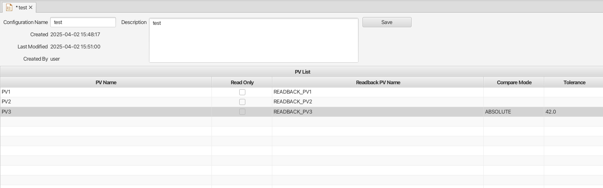
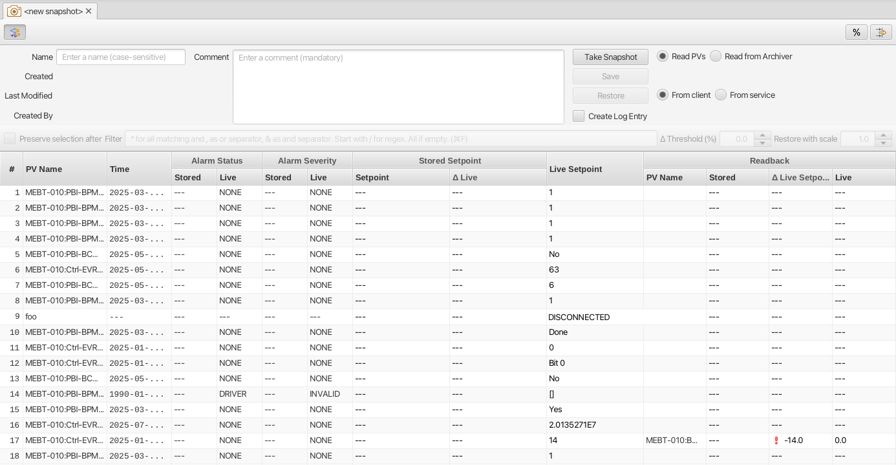
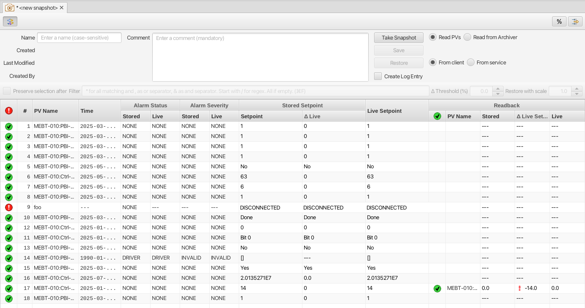
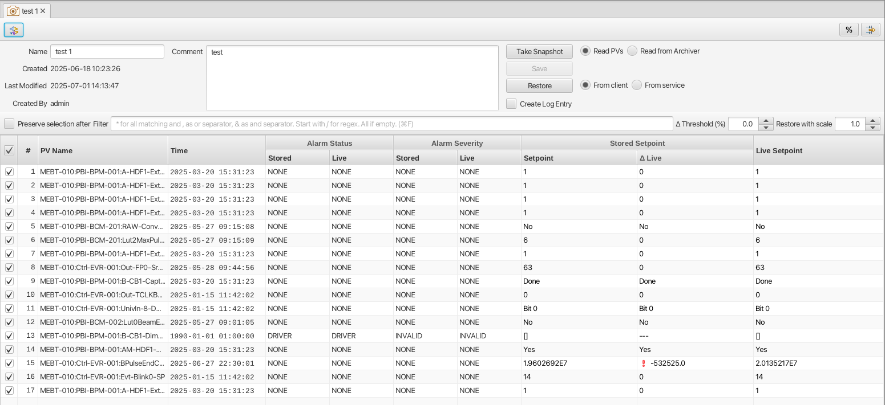
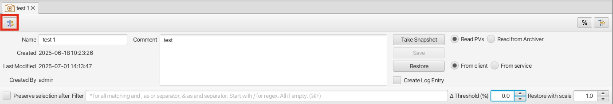
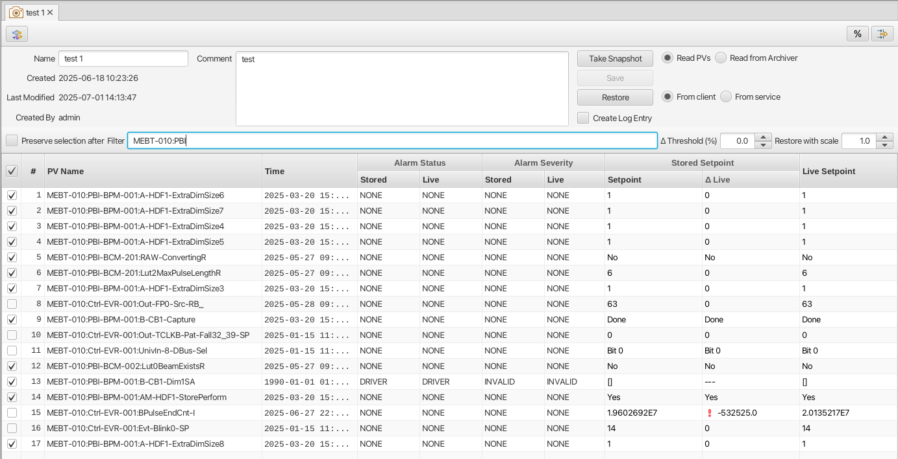
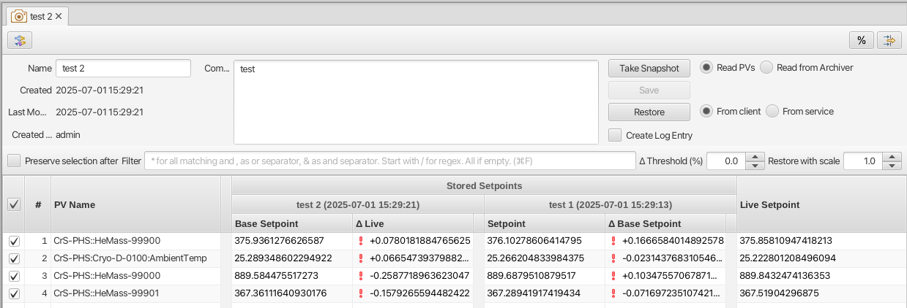
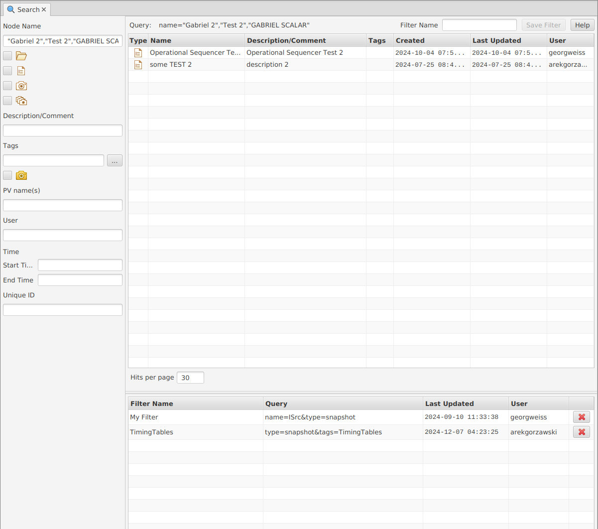
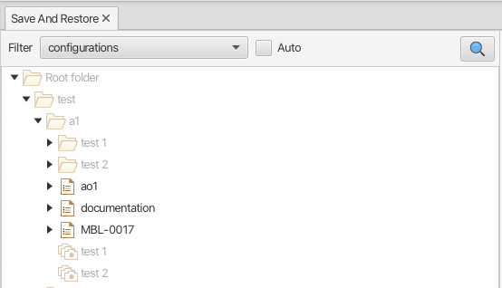

Save-And-Restore
================

Overview
--------

The save-and-restore application can be used to take "snapshots" of a pre-defined list if PVs at a certain point in
time, and write the persisted values back at some later point.

Data is managed by a central service to which the client UI connects.

Actions that create, modify or delete data are protected by the service. User must sign in through the
Credentials Manager application. See also below.

Nodes and node types
--------------------

Save-and-restore data managed by the service is arranged in a tree structure and hence presented in the client UI using
a tree view UI component. In the following objects in the tree are referred to as "nodes".

The root of the tree structure is a folder that may only contain folder nodes. Folders may contain sub-folders, configurations and composite snapshots.
The child nodes of a configuration are snapshots associated with that configuration.

Additionally a composite snapshot node may reference an arbitrary number of snapshot or composite snapshot nodes.

There are thus four node types managed in the application:

- |folder| **Folder**: container for folders and configurations.
- |configuration| **Configuration**: a list of PV names and associated meta-data.
- |snapshot| |golden|  **Snapshot**: PV values read from PVs listed in a configuration.
- |composite-snapshot| **Composite Snapshot**: aggregation of snapshots or other composite snapshots, or both.

.. |composite-snapshot| image:: images/composite-snapshot.png

*NOTE*: If a folder or configuration node is deleted, all child nodes are unconditionally and recursively deleted. The user
is prompted to confirm delete actions as they are irreversible.

Below screen shot shows the tree structure and a configuration editor.

.. image:: images/screenshot1.png
   :width: 80%

Node names and ordering
-----------------------

Node names are case sensitive. Within a parent node child node names must be unique between nodes of same type.

Child nodes in the tree view are ordered first by type (folders, configurations, composite snapshots), then by name.
Child nodes of configurations can only be of type snapshot and are ordered by name. The tooltip of a node
will provide information on date created and user name:

A word of caution
-----------------

Save-and-restore data is persisted in a central service and is therefore accessible by multiple
clients. Users should keep in mind that changes (e.g. new or deleted nodes) are not pushed to all clients.
Caution is therefore advocated when working on the nodes in the tree, in particular when changing the structure by
copying, deleting or moving nodes.

Tree View Context Menu
----------------------

Most actions performed in the client UI are invoked from the tree view's context menu, which appears like so:

Since the set of applicable actions varies between node types, items in the context menu enabled/disabled
and added/removed based on the current selection in the tree. Note that right-clicking on a tree item implicitly selects that item
if not already selected.

Brief description of all items in the context menu (details on actions are outlined below):

* Login - launch authentication dialog. This item is hidden when user is signed in to the service.
* Create Folder - create a new folder in a folder.
* New Configuration - create a new configuration in a folder.
* New Snapshot - crate a new snapshot based on a configuration.
* New Composite Snapshot - create a new composite snapshot in a folder.
* Restore from client - restore a snapshot or composite snapshot from the client application.
* Restore from service - restore a snapshot or composite snapshot from the service.
* Edit - edit a configuration.
* Rename - rename a folder or configuration.
* Copy - put selected items on clipboard.
* Paste - paste items from clipboard.
* Delete - delete selected items.
* Compare Snapshots - compare a snapshot in view to the selected.
* Add Golden Tag - tag a snapshot as "golden".
* Tags with comment - add/delete tag on a snapshot or composite snapshot.
* Copy unique id to clipboard - put a nodes unique string id on the clipboard.
* Import ... from CSV - import configuration or configuration from CSV file.
* Export ... to CSV - export configuration or snapshot to CSV file.
* Create Log - launch log entry editor.

Drag-n-drop
-----------

Nodes in the tree can be moved using drag-n-drop. The following restrictions apply:

* Configuration and folder nodes may be moved if target is a folder.
* Configuration and composite snapshot nodes cannot be moved to the root folder.
* A move operation on snapshot nodes is supported only if the target is a composite snapshot node. This will launch the editor for that composite snapshot. The source nodes are of course not removed from their parent node.
* Target folder may not contain nodes of same type and name as nodes subject to a move operation.

Checks are performed on the service to enforce the above restrictions. If pre-conditions are not met when the selection
is dropped, the application will present an error dialog.

Drag-n-drop is disabled if multiple nodes are selected and if:

* Selection contains a combination of folder and configuration nodes. Selected nodes must be of same type.
* Selection contains nodes with different parent nodes. Selected nodes must have the same parent node.

Once a selection of nodes have been moved successfully, the target folder is refreshed to reflect the change.

Copy/paste
----------

Nodes may be copy/pasted using the context menu. The following restrictions apply:

* Folder nodes cannot be copied.
* A copy operation of a configuration node will not copy its snapshot child nodes. These must be copied as a separate copy operation.
* A snapshot node may be pasted into a configuration only if the list of PVs matches.
* If the target node already contains a node of same type and name, the pasted node(s) will acquire the same base name, plus a suffix like "copy", "copy 2", "copy 3" etc.

For a multi-selection of nodes the same restrictions apply as for a drag-n-drop move operation, see above.

Logging
-------

If a logbook implementation is available, the optional logging module can be used to launch a log entry
editor for the purpose of logging when a new snapshot has been saved or restored.
Properties of the snapshot (name, date etc) are automatically set on the log entry rendered by the editor. If
a restore action has failed to write one or multiple PVs, a list of these PVs is also added to the log entry.

In this case the log entry is empty save for a log entry property containing the name and path to
the selected item in the tree. Note that this context menu entry is not available if a logbook implementation
has not been configured. Moreover, the context menu entry is enabled only if a single node in the tree view
is selected.

Workflow
--------

The following sections describe typical use cases when working with configurations and snapshots.

Folder
------

Folder nodes can be created from the New Folder option of the folder node context menu.
Folder names are case-sensitive and must be unique within the same parent folder.

Configuration View
------------------

A new configuration is created from the context menu launched when right-clicking on a folder node in the tree view.
This screenshot shows the configuration editor:

PVs are added using the input field at the bottom of the view. Multiple PV names may be added if separated by
space or semicolon.

Specifying a read-back PV is optional. Specifying multiple read-back PV names is supported, and these will be associated
with PVs in the order they appear.

PV entries in a configuration marked as read only will be omitted whe performing a restore operation.

Compare Mode and Tolerance data is optional. This is used by the service when a client requests comparison between
stored and live values of a snapshot. More information on this feature is found in the service documentation.

To add a very large number of PVs, user should consider the import feature available via the "Import Configuration file to this folder"
option in the context menu of a folder node in the tree view.

The file format for such a file is::

    PV,READBACK,READ_ONLY
    PV1,READBACK_PV1,0
    PV2,,1
    PV2,READBACK_PV3,1
    .
    .
    .

The first line is a heading an cannot be omitted. An import of the above example will launch a dialog like so:

.. image:: images/import-config-dialog.png
   :width: 80%

Another option to add a list of PVs is to use the Channel Table application. In the table user may select wanted
PVs and launch the context menu to create a new configuration, or to add the selected PVs to an existing configuration:

.. image:: images/channel-table-create-configuration.png
   :width: 80%

Note however that creating or updating a configuration based on a selection from the Channel Table may only populate a
list of PVs. If read-back PVs are needed, they need to be added manually in the launched import dialog.

To save a configuration user must specify a (case sensitive) name and a description. Configuration names within a
folder node must be unique.

Configurations may be updated with respect to name and description. Updating the list of PVs is also supported,
but user should keep in mind that existing snapshots associated with that configuration are *not* updated, e.g.
PVs removed from a configurations will remain in existing snapshots.

Create Snapshot
---------------

To create a new snapshot one selects the New Snapshot option from the context menu of the tree view.
This will open the snapshot view:

The left-most column will show live values for the list of PVs in the configuration. If the application fails to
connect to a PV, this will be indicated accordingly.

Clicking the Take Snapshot button will disable the UI while all PVs are read. Once the read operation completes,
values are displayed in the view:

Note that the Timestamp column shows the timestamp as provided by the PV record, i.e. it need not be the current timestamp.

Once a snapshot has been taken, user must provide a case sensitive name and comment to be able to save it. Snapshot names
for the same configuration must be unique. User may choose to take a new snapshot in the same view before saving it.
Note that for a configuration with a large number of PVs the save operation may take some time, during which the UI is
disabled.

Create Composite Snapshot
-------------------------

A composite snapshot is an aggregation of existing snapshots or other composite snapshots, or both. Composite snapshots
are **not** associated with a configuration. Instead the "configuration" - i.e. list of PVs - is implied by the list of
referenced snapshots.

To create a composite snapshot user must select the New Composite Snapshot context menu option of a folder node into
which the composite snapshot will be saved. This launches the composite snapshot editor:

Snapshot or composite snapshot items can be added to the list view in the editor by dragging wanted objects from the tree view
and dropping them in the list.

The composite snapshot can be saved when a case sensitive name and a description has been specified.

**NOTE:** There are a few business rules to consider when managing composite snapshots:

* The combined list of PV names in the referenced snapshots must not contain duplicates. This is checked for each item dropped into the list when editing a composite snapshot. If duplicates are detected, an error dialog is shown.

* Snapshots and composite snapshots cannot be deleted if referenced in a composite snapshot.

Edit Composite Snapshot using drag-n-drop
^^^^^^^^^^^^^^^^^^^^^^^^^^^^^^^^^^^^^^^^^

From the Search And Filter view (see below) user may select snapshots or composite snapshots and then drag-n-drop
the selection onto an existing composite snapshot in the left-hand side tree view.

Restore Snapshot View
---------------------

To open a snapshot to perform a restore operation, one must double-click on a snapshot node in the tree view. This
will open the snapshot in "restore" mode, i.e. the Restore button is enabled:

As seen from the screenshot, the :math:`{\Delta}` Live Setpoint column highlights PVs where there is a difference :math:`{\neq}` 0 between
stored and live values. For array PVs the comparison is made element by element. For PV types where showing a difference
is difficult (e.g. arrays) or not meaningful (booleans, enums), this column shows a suitable message instead of a :math:`{\Delta}` value.

User may choose to suppress highlighting of :math:`{\Delta}` values :math:`{\neq}` 0 for scalar data type PVs by specifying a threshold value:

.. image:: images/snapshot-threshold.png
   :width: 80%

It is also possible to hide all PV items where the stored value is equal to live value. The right-most button in the
toolbar is used to toggle between show/hide:

.. image:: images/toggle-delta-zero.png
   :width: 80%

The snapshot view does by default not show PV read-back values if such have been defined in the configuration.
The left-most columns in the toolbar can be used to show/hide columns associated with such read-back PVs:

Restoring A Snapshot
--------------------

To restore the values in the snapshot user should click the Restore button. During the restore operation the UI is
disabled. In case a write operation fails on a PV, the process is *not* aborted, and user will be
presented with a list of failed PVs when restore operation completes.

**NOTE:** During the restore operation PVs are written in parallel, i.e. in an asynchronous manner. The order of
write operations is hence undefined.

Prior to restore user has the option to:

* Exclude PVs using the checkboxes in the left-most column. To simplify selection, user may use the Filter input field to find matching PV names:

* Specify a multiplier factor :math:`{\neq}` 1 applied to scalar data type PVs:
.. image:: images/restore-with-scale.png
   :width: 80%

Restoring from a composite snapshot works in the same manner as the restore operation from a single-snapshot.

Restore from context menu
^^^^^^^^^^^^^^^^^^^^^^^^^

User may invoke a restore operation (from client or from service) from context menu items in the tree
view or in the search-and-filer view. In this case user will not have the possibility to unselect specific PVs.
However, PV items configured as read-only will not be restored.

Comparing Snapshots
-------------------

To compare two (or more) snapshots, user must first open an existing snapshot (double click in tree view). Using the
Compare Snapshots context menu item for a snapshot node user may choose a snapshot to load for comparison.

Once the additional snapshot has been loaded, the snapshot view will show stored values from both snapshots. In this view
the :math:`{\Delta}` Base Snapshot column will show the difference to the reference snapshot values:

Compare to archiver data
------------------------

In the context menu of a tab showing a snapshot user can chose to compare the snapshot to data retrieved from an
archiver, if one is configured:

.. image:: images/compare_to_archiver.png

Selecting this item will trigger a date/time picker where user can specify the point in time for which to get
archiver data:

Once data has been returned from the archiver service, it will be rendered as a snapshot in the comparison view.

**NOTE:** If the archiver does not contain a PV, it will be rendered as DISCONNECTED in the view.

Search And Filters
------------------

The search tool is launched as a separate view through the icon on top of the tree view:

.. image:: images/launch-search.png

The search tool is rendered as a separate tab and will always be the left-most tab in the right-hand side pane of the
save&restore UI:

In the left-hand side pane user may specify criteria to match nodes. The above screen shot shows an example to search
for snapshot nodes. The table on the right-hand side will show the result.

In the toolbar above the search result list user may choose to save the search query as a named "filter". The Help
button will show details on how to specify the various search criteria to construct a suitable query. Filter names
are case sensitive. Note that if any text is present in the "Unique ID" field then the "Save Filter" button will be
disabled.

The bottom-right pane in the search tool shows all saved filters, which can be edited or deleted. If a filter is edited
and saved it under the same name, user will be prompted whether to overwrite as filter names must be unique.

In the tree view user may select to enable and chose a saved filter:

Nodes in the tree view matching a filter will be highlighted, i.e. non-matching items are not hidden from the view.

**NOTE:** When selecting a filter in the tree view, only matching items already present in the view will be highlighted.
There may be additional nodes matching the current filter, but these will be rendered and highlighted only when their parent nodes
are expanded. To easily find *all* matching items user will need to use the search tool.

Tagging
-------

Tagging of snapshots can be used to facilitate search and filtering. The Tags context menu option of the
snapshot node is used to launch the tagging dialog.

In the dialog user may specify a case sensitive tag name. When typing in the Tag name field,
a list of existing tag names that may match the typed text is shown. User may hence reuse existing tags:

.. image:: images/tag-hints.png

**NOTE:** The concept of "golden" tags can be used to annotate snapshots considered to be of particular value. Such
snapshots are rendered using a golden snapshot icon: |golden|

User may delete a tag through the tagging sub-menu:

.. image:: images/delete-tag.png

Tagging multiple snapshots
^^^^^^^^^^^^^^^^^^^^^^^^^^

If user selects multiple snapshot nodes in the tree view, all of the selected nodes can be tagged with the same tag in one single operation.
Note however that this is possible only if the wanted tag is not already present on any of the nodes.

Deleting tags on multiple snapshots
^^^^^^^^^^^^^^^^^^^^^^^^^^^^^^^^^^^

If user selects multiple snapshot nodes, tags may be deleted on all of the nodes in one single operation. Note however
that the context menu will only show tags common to all selected nodes.

Tagging from search view
^^^^^^^^^^^^^^^^^^^^^^^^

The search result table of the Search And Filter view also supports a contect menu for the purpose of managing tags:

Invoke a restore operation from search result
^^^^^^^^^^^^^^^^^^^^^^^^^^^^^^^^^^^^^^^^^^^^^

Snapshot and composite snapshot items in the search result table support an additional context menu item users can
choose in order to perform a restore operation.

Snapshot View Context Menu
--------------------------

A right click on a table item in the restore snapshot view launches the following context menu:

The items of this context menu offers actions associated with a PV, which is similar to "PV context menus" in
other applications. However, user should be aware that the "Data Browser" item will launch the Data Browser app for
the selected PV *around the point in time defined by the PV timestamp*.

Authentication and Authorization
--------------------------------

Authorization uses a role-based approach like so:

* Unauthenticated users may read data, i.e. browse the tree and view configurations, snapshots, search and view filters.
* Role "user":
    * Create and save configurations
    * Create and save snapshots
    * Create and save composite snapshots
    * Create and save filters
    * Update and delete objects if user name matches object's user id and:
        * Object is a snapshot and not referenced in a composite snapshot node
        * Object is a composite snapshot node
        * Object is configuration or folder node with no child nodes
        * Object is a filter
* Role "superuser": +perform restore operation
* Role "admin": no restrictions

Roles are defined and managed on the service. Role (group) membership is managed in Active Directory or LDAP.

Integration with the Display Builder application
------------------------------------------------

It is possible to configure Display Builder actions to interact with the Save-And-Restore application. Such actions are available as either items
in the context menu of a Display Builder widget, or actions associated with an Action Button widget, or both.

When Save-And-Restore actions are executed, the application is launched or put in focus. The following action types
are supported:

* | Open a configuration, snapshot or composite snapshot node in the Save-And-Restore application.
  | This can be used to quickly access a particular node in order to invoke a restore operation.
* | Open a named filter in the Save-And-Restore Filter View application.
  | This will open/show the Filter View application and automatically perform the search associated with the named filter.
  | This feature can be used to quickly navigate from a Display Builder screen to a view containing a set of commonly used snapshots.

Configuring actions
^^^^^^^^^^^^^^^^^^^

When configuring an action in the Display Builder editor, supported actions are available from a list:

For the open node action, user may either paste the unique id of a node into the input field, or launch a
browser to select a node:

For the open filter action, user can select from a drop-down list showing existing named filters:

