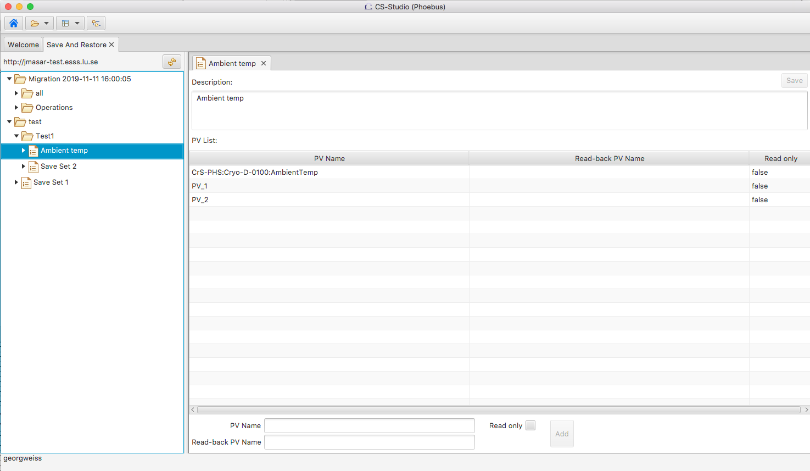

Save-And-Restore
================

Overview
--------

The save-and-restore application can be used to take a snapshot of a pre-defined list if PVs at a certain point in
time, and write the persisted values back to the IOCs at some later point.

The application depends on the save-and-restore service deployed on the network such that it can be accessed over
HTTP. The URL of the service is specified in the save-and-restore.properties file or in the settings file
pointed to on the command line.

Connection to PVs works the same as for visual components. The preference org.phoebus.pv/default will determine
how the connection will be set up (ca or pva), but user may explicitly select protocol by using scheme prefix
ca:// or pva://, e.g. ca://my_PV.

Object types
------------

There are three object types managed by the save-and-restore service through the application:

- Folder: container of other folders or save sets.
- Save set: a list of PV names and associated meta-data.
- Snapshot: the PV values read from PVs listed in a save set.

All objects are managed as nodes of a tree structure. The root of the tree structure is a (hidden) folder that may only
contain folder objects. Folders may contain sub-folders or save sets, or both. The child nodes of a save set are
snapshots associated with that save set.

*NOTE*: If a folder or save set node is deleted, all child nodes are unconditionally and recursively deleted! The user
is prompted to confirm delete actions.

Below screen shot shows the tree structure and a save set editor.

