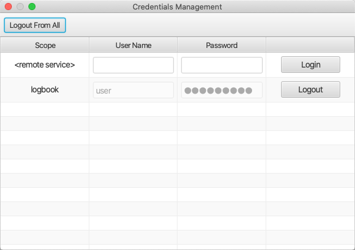
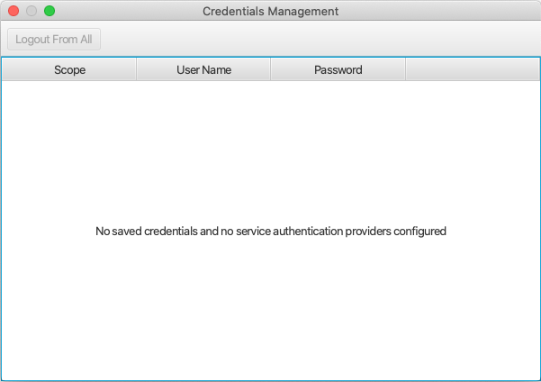

Active Jobs
===========

Opened from the ``Applications``, ``Debug`` menu,
the Active Jobs panel displays ongoing background jobs.

Examples include jobs that load configuration files.
Long-running jobs can be cancelled.

Implementation Detail
---------------------

Canceling a job asks the application to abort an ongoing job
and depends on a proper implementation of the application feature
to honor the request.

PV List
=======

Opened from the ``Applications``, ``Debug`` menu,
the PV List panel lists all active PVs,
their connection state and the reference count.

Credentials Management
======================

Some applications may need to prompt the user for credentials, e.g. when interacting with a protected
remote service. One such example would be the electronic logbook.

Further, Phoebus may be configured to store the credentials entered by the user to avoid repeated prompts.
In order to also support an explicit logout capability, the Credentials Management application offers means to
remove stored credentials.

In some cases an explicit login procedure can be useful, e.g. login to service for the purpose of storing
user credentials and thereby support automated creation of logbook entries.

The application is launched using the dedicated button in the (bottom) status bar.

The below screen shot shows an example where credentials have been stored for the "logbook" scope,
plus an option to login to the "<remote service>" scope. User may also choose to "logout" from all scopes,
i.e. to remove all stored credentials.

If no credentials are stored in the credentials store, and if no services supporting authentication have been configured,
the Credentials Management UI will show a static message:

