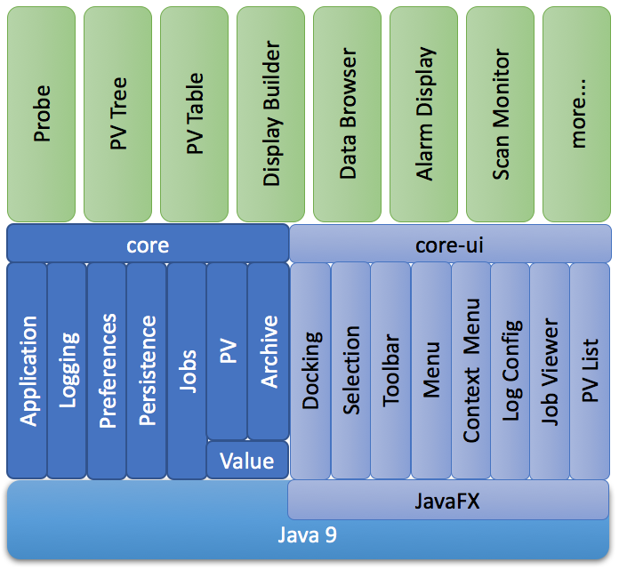

Architecture
============

The fundamental phoebus architecture consists of **core** modules,
user-iterface related **core-ui** modules, and **app** modules.
The core modules provide the infrastructure, while app modules
implement specific application functionality.
Everything is based on Java version 9 or higher, using Java FX as
a graphics library.

A Phoebus product may contain just one application,
for example only one of Probe, PV Tree, PV Table, Display Builder Runtime,
so you end up with several Phoebus products that each perform one function.
Alternatively, you can assemble a Phoebus product that
contains all these applications. This allows integration between the applications,
for example via context menues that start other PV-related applications based
on the current selection.

Core Modules
------------

core-framework:
   Fundamentals that many applications use, for example prerences, persistence,
   jobs, macros, localization, autocompletion.
   
   Defines the ``AppDescriptor`` and ``AppResourceDescriptor`` Java Service Provider Interfaces (SPI)
   which are used to locate applications.
   Each application feature identifies itself by implementing an application descriptior
   that describes to the Phoebus framework what the name of
   the application is, which types of resources (e.g. data files) it might accept,
   and most importantly how to start one or more instances
   of the application.
   
   To create an ``AppInstance``, i.e. an application instance, the framework invokes
   the ``create()`` method of the application descriptor.
   This will typically result in a new application instance, i.e. a new tab in the UI.
   Certain applications like the job viewer will create a singleton application instance.

   On shutdown, the state of all windows and tabs is persisted
   in a memento file, and each ``AppDescriptor`` can also
   persist its own state.
   On startup, each window and tab is restored,
   the applications are restarted, and each application
   can restore its specific state from the memento.
 
   The ``JobManager`` API allows submitting jobs based on a ``JobRunnable``
   that supports progress reporting and cancellation.
 
core-pv:
   API for access to life data from Process Variables.
   
core-logbook:
   API for accessing a logbook, with SPI for site-specific implementations. 

core-email:
   API for creating emails. 

core-security:
   API for authorization and secure storage. 

core-ui:
   The ``docking`` package supports a window environment similar to a web browser.
   Each window can have multiple tabs.
   Users can move tabs between existing windows,
   or detach them into newly created windows.
   
   The top-level Java FX ``Node`` for each application's
   UI scene graph is basically a ``Tab``,
   wrapped in a Phoebus ``DockItem`` that tracks the
   ``AppInstance`` to allow it to be saved and restored.

   The toolbar, main menu and context menues accept
   SPI-based contributions.

   The ``selection`` package allows publishing and monitoring a selection of
   for example PVs.
   
   The ``undo`` package simplifies the implementation of undo/redo
   functionality.

App Modules
-----------

Each app module implements a certain application feature, for example
Probe, PV Tree, Display Builder.
While application modules depend on one or more core modules, there should
be few if no inter-application dependencies, allowing a product to contain
only the desired applications.

Products
--------

Each core and application module is built into a ``jar`` file.
A product contains a ``lib/`` directory with the desired modules.
When invoking the ``Launcher``, it locates the available applications,
menu and toolbar entries via SPI.
Adding or removing Probe, PV Tree, .. from a product
is done by simply adding or removing the respective jar file.

Services
--------

Similar to a product, a service is a runnable tool, but typically
for a non-UI functionality like a scan server, archive engine,
alarm handler or logger.
