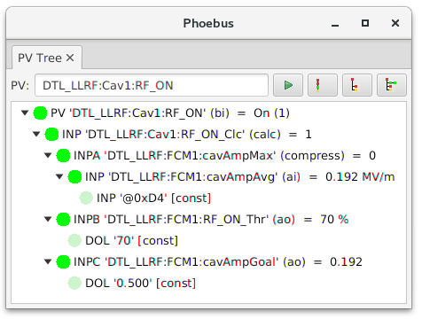
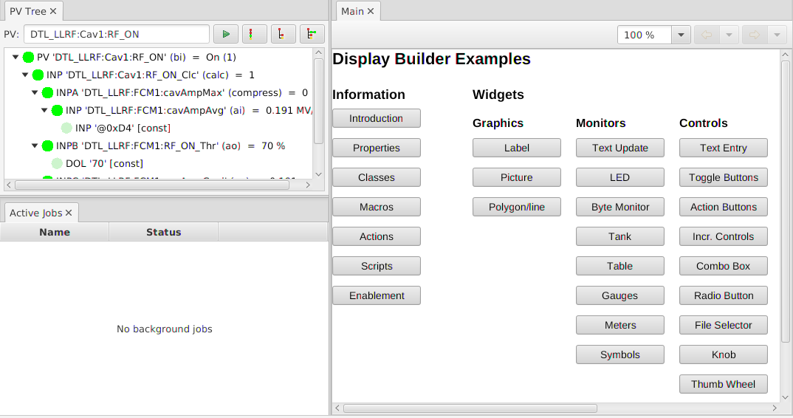
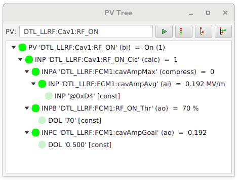
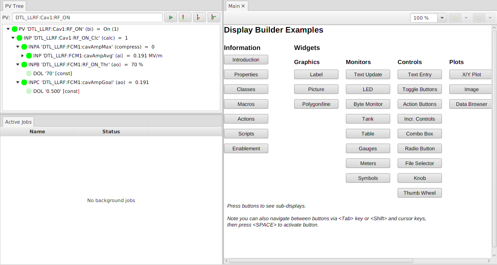

Window Environment
==================

When you start Phoebus for the first time, it opens a main window.
As you use the *Applications* menu to open for example Probe, the PV Tree etc.,
these all open up as new Tabs in the original window.

    Window with just one tab, showing that tab so you can drag it.

Tabs and Windows
----------------

The behavior of these tabs is very similar to the handling of tabs
in a web browser.
You can rearrange the tabs within a window by dragging them around.
You can also drag a tab out of the window to detach it into its own window.
Alternatively, you can invoke the *Detach* option from the context menu of the tab
to detach it.
Tabs can be dragged between the main window and such detached windows.

Split Panes within a Window
---------------------------

The tab context menu options to *Split Horizontally* or *Split Vertically*
will create sub-panels witin the window between which tabs can be arranged.

    In this example, the original PV Tree tab has been split *horizontally*,
    creating a left and right section.
    The left section contains the original PV Tree.
    A new Display Builder panel has been placed into the originally empty right section.
    Next, the PV Tree tab on the left has once more been split, this time *vertically*,
    and a new Jobs viewer has been placed in the newly created bottom half.

To un-do a split, simply move all tabs out of a split section.
When a split section is empty, it will be merged back with its sibling
(unless the pane is named, see below).

Hide Tabs
---------

By default, even a window with just one tab will show that tab.
This has the advantage that you can then grab that tab to move it
into another window, or arrange tabs in the split subsections of a window.
At times, however, you may prefer to hide such singular tabs
to preserve screen space.
In the *Window* menu, select *Always show Tabs* to show respectively hide
singular tabs.

    Window with just one tab, hiding the actual tab to offer more screen space.

Saving & Restoring the Window Layout
------------------------------------

The current window layout is saved to a ``memento`` file when exiting the program.
This ``memento`` file is by default located within a ``.phoebus`` subdirectory of the user's home directory.
To change the location from ``$HOME/.phoebus`` to a custom location, set the Java System property ``phoebus.user`` to the desired location.

When later starting the program back up, it will load the saved window layout.

By making the ``memento`` file read-only, system administrators can prevent the program from updating the file on exit.
Each time the program is started, it will thus start out with a known window layout.

The application *Window* menu option *Save Layout As..* allows saving the current window layout under
a name. The *Window* menu option *Load Layout* offers a list of all saved layout. Selecting a saved layout
switches from the current display layout to a saved one.

Saved, named layouts are stored in files similar to the default ``memento``, but including the name of the
saved layout. These saved layout memento files can be deleted is no longer needed, copied to different installations,
or made read-only to prevent replacement by end users.

Locking the Window Layout
-------------------------

The context menu of a tab within a pane allows locking and un-locking a pane.

A locked pane keeps its current set of tabs.
Tabs cannot be moved out of a locked pane,
they cannot be closed,
nor can new tabs be added to a locked pane.
A locked pane cannot be split.

    In this example, the upper and lower panes on the left are locked.
    Note that the tabs for the PV Tree and Active Jobs have no ``x`` to close them.
    These tabs cannot be closed, they cannot be moved to other window sections,
    and you can no longer add new tabs into these *locked* panes.

Locked panes allows you to create a default layout that contains certain fixed panes
which the user cannot accidentally delete at runtime.

Named Panes
-----------

The context menu of a tab allows naming the pane which contains the tab.

Display Builder builder panels can be configured to open new tabs
in a specific, named pane. If that pane does not exist, it will be created,
but ideally such displays are used within a layout that already contains
the appropriately named panes.

A named pane will remain visibly even when empty. It will not be merged with
sibling tabs.
