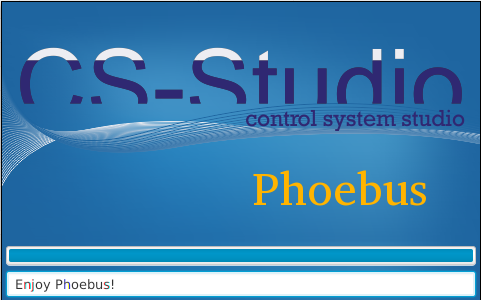

.. Phoebus documentation master file, created by
   sphinx-quickstart on Wed Sep 20 09:34:53 2017.
   You can adapt this file completely to your liking, but it should at least
   contain the root `toctree` directive.

Welcome to the CS-Studio/Phoebus Documentation!
===============================================

.. toctree::
   :maxdepth: 1
   :caption: User Documentation

   intro
   running
   docking
   preferences
   logging
   persistence
   authorization
   applications
   services
   services_architecture

.. toctree::
   :maxdepth: 1
   :caption: Developer Documentation

   develop
   phoebus_product
   architecture
   locations
   help_system
   localization
   preference_properties
   changelog
   docker
   trouble_shooting
   eclipse_debugging
   gui_testing
