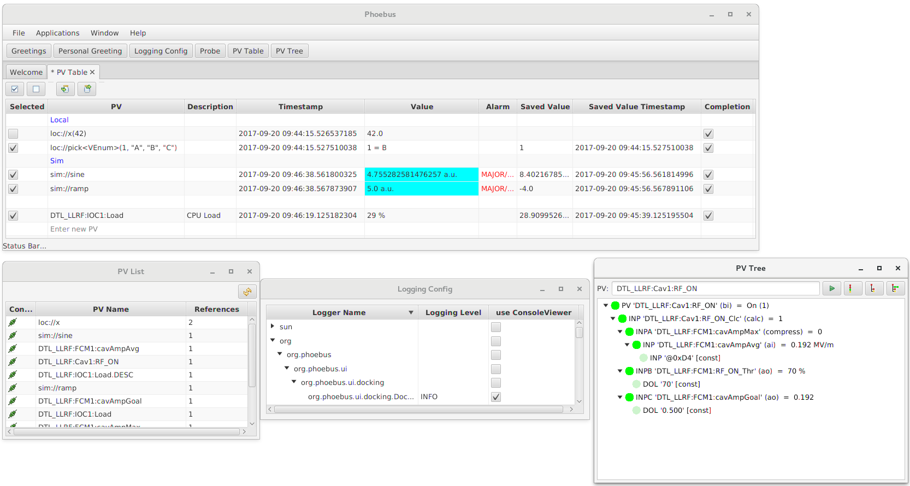

Introduction
===================================

Phoebus is an update of the Control System Studio toolset
that removes dependencies on Eclipse RCP and SWT.

While Eclipse RCP kick-started the original CS-Studio implementation
and served CS-Studio well for about a decade,
depending on RCP also added limitations to the control system
user interface development.

Goals of the Phoebus project:

 * Retain functionality of key CS-Studio tools,
   specifically the Display Builder, Data Browser,
   PV Table, PV Tree, Alarm UI, Scan UI, ..
   supporting their original configuration files
   with 100% compatibility.

 * Provide full control of window placement
   free from RCP restrictions, for example
   allowing us to save/restore panel layouts.

 * Use Java FX as the graphics library to overcome
   limitations of SWT.

 * Prefer core Java functionality over external
   libraries whenever possible:
   Java FX as already mentioned,
   SPI for locating extensions,
   java.util for logging and preferences.
   In the future, we may also use the module
   mechanism introduced in Java 9
   for bundling.

 * Reduce build system complexity,
   fetching external dependencies in one initial step,
   then supporting a fully standalone, reproducible
   build process,
   allowing multiple build methods instead of being
   restricted to one.

For more, see https://docs.google.com/document/d/11W52PRlsRjpIvP81HxUxxR9g180DHDByCohYQ9TQv7U
