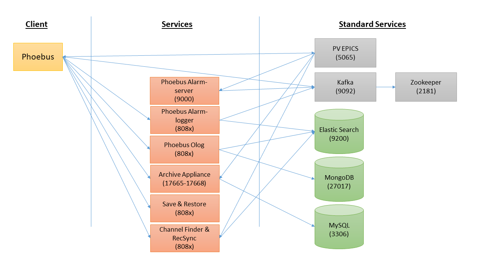

Services Architecture
=====================

Architecture diagram
--------------------

| This architecture diagram shows the main services used by phoebus and their port.
| Port 808x means : 8080 is used by default. It must be changed if running on the same server as the other services.

Settings configuration
----------------------

Example of settings.ini 

**Alarm Server**

| org.phoebus.email/mailhost=smtp.com
| org.phoebus.applications.alarm/server=localhost:9092
| org.phoebus.applications.alarm/enable_slot_time=false

**Alarm Logger**

| org.phoebus.applications.alarm.logging.ui/service_uri=http://localhost:8082
| org.phoebus.applications.alarm.logging.ui/results_max_size=10000

**Olog**

| #Logbook
| org.phoebus.logbook.ui/logbook_factory=olog-es
| org.phoebus.logbook/logbook_factory=olog-es
| org.phoebus.logbook.olog.ui/save_credentials=true
| #Olog
| org.phoebus.olog.es.api/olog_url=http://localhost:8081/Olog
| org.phoebus.olog.es.api/username=admin
| org.phoebus.olog.es.api/password=adminPass

**Archive Appliance**

| org.csstudio.trends.databrowser3/urls=pbraw://localhost:17668/retrieval

**Save & Restore**

| org.phoebus.applications.saveandrestore.datamigration.git/jmasar.service.url=http://localhost:8084

**Channel Finder**

| org.phoebus.channelfinder/serviceURL=http://localhost:8080/ChannelFinder
